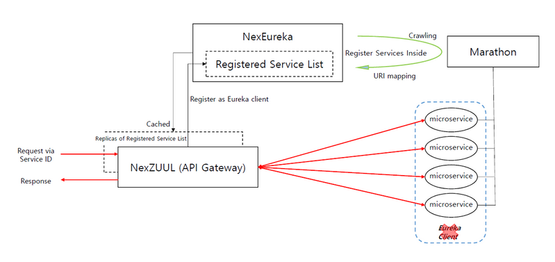
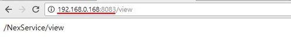
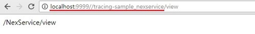

NexGate

- **NexGate is NexCloud’s API Gateway made of NexEureka and NexZUUL using the Spring Cloud for DC/OS. Just install NexEureka and NexZUUL and access microservices through service name without Eureka client.**
- **Architecture** 
- **Environments** - Over JAVA 8 - Over Spring 4 - Over Spring boot 1.5.9 - Over Maven 3.5.2
- **Installation** Go to [https://github.com/TheNexCloud/NexGate](https://github.com/TheNexCloud/NexGate)
- **Demos** - Now, you are able to access services via NexGate. Here are samples that you can simply use NexGate. **·** When you access NexEureka endpoint, then you can see the following screen. **·** This screen shows service lists deployed by Marathon and Mesos DNS that we registered. **·** The following image is an API service that we access endpoint directly. It can be an application you developed**·** The URL in this image is a direct access point for sample API service. **·** You can see service list registered to NexEureka through _NEXZUUL\_ENDPOINT/routes._**·** Our sample API service ID is _tracing-sample\_nexservice._ **·** You can access this service via NexZuul. This indicates that you can access any service through _NexZuul/service\_id._

<!--truncate-->

- **NexEureka is the NexCloud’s customed Eureka that can register service without Eureka client. In standard Eureka, you must inject dependency to registered service. But, in NexEureka, you need just NexEureka service on your server. We made functions that crawl services deployed by Marathon and register them to Eureka Server. It renews service list by 30 secs, so it is safe when an error occurred from one of services instances.**
- **Waht is Eureka?** - Eureka is a Spring Cloud project for service discovery in Micro Service Architecture. If you want to use service discover by Eureka, you have to initialize Eureka Server by putting _@EnableEurekaServer_ annotation in the main class of Eureka Server Project. Then put _@EnableEurekaClient_ annotation in the main class of service that you want to use. - Eureka has server – client Architecture for service registry. So you must have client source to register to Eureka server. \- If Eureka client is registered to Eureka server, client replicates services registered to the server. If the service is not edge service, it is inefficient that eureka dependency is injected to project. - By defaults, the Spring Cloud supports only JAVA application, so if you want to register NON-JAVA application, you need to adopt side-car.
- **Advantages of NexEureka** - Supports service discovery by itself. - Supports polyglot without side-car. - Supports high availability.

- **NexZUUL is the NexCloud’s customed ZUUL. As we explained, A service initialized as a Eureka client cached service list from Eureka server. So NexZUUL is the only Eureka client on Micro Service Architecture.**
- **What is ZUUL?** - ZUUL is a simple gateway service or edge service. So its main goal is routing, monitoring, error management and security. Many API gateway products offer limited functions, but ZUUL is free to customize its functions for developers. - API gateway using Eureka and ZUUL\> You must inject Eureka client dependency to you micro service
- **With NexEureka, just deploy microservices with no additional dependencies and access service through service name.**

