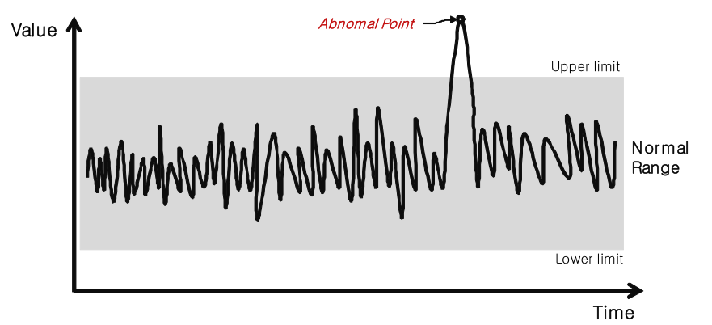
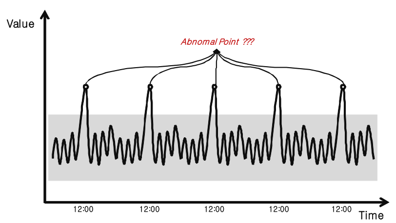

By [Kevin Ko](mailto:support@nexclipper.io) , PhD, Data Scientist

**_What is anomaly detection?_**

Anomaly detection is the identification of data points, items, observations or events that do not **_conform to the expected pattern_** of a given group. These anomalies occur very infrequently but may signify a large and significant threat such as cyber intrusions or fraud.

<!--truncate-->

Here, the paragraph, “_conform to the expected pattern”_is the most important. In other words, finding anomalies means finding a case that is hard to happen in a normal situation.

**_How to find anomalies?_**

The key to anomaly detection is forecasting or predicting normal cases. If we can figure out what the metric will be in the normal case ( **_Normal Range_** ), we can find out anomaly through the degree of deviation from that range, or we can calculate the degree of anomaly. See the following figure.

The traditional method of anomaly detection is to set an upper limit and a lower limit through rule-set like the figure above. However, this general method has a disadvantage that a person has to set rules by empirical judgment. Also, there is another disadvantage in that the upper limit and the lower limit are fixed without changing according to the change of time or changing of system conditions. See the following figure.

As you can see the figure above, Normal Range can be changed by time or system condition. So the rule set that we set up is meaningless. Therefore, a good anomaly detection system or algorithm should have the following characteristics. First, it should be able to automatically predict normal penalties. Second, the normal range should be automatically adjusted depending on the characteristics of the data that change over time or change. See the following figure.

**_How do you handle regular patterns?_**

Sometimes points beyond the normal range may appear repeatedly. For example, if the normal range is between 50 and 100 and the value ranges from 160 to 170 at 12 pm every day, can you think of this as an anomaly? The answer is that these regular abnormalities are not abnormal cases.

To solve this problem, the nexClipper anomaly detection algorithm implemented logic to automatically detect seasonal patterns. This allows us to adjust the normal range automatically at specific times. See the following figure.

**_What are the advantages of using NexClipper Anomaly Detection?_**

- It has various forecasting algorithms that can predict the normal range. **(Forecasting Normal Range)**
- With Continuous Learning, the normal range is automatically corrected and adjusted to suit new data or environments. **(Appling Continuous Learning)**
- Automatically finds the temporal patterns embedded in the data. **(Automatically Finding Temporal Patterns)**

**\[NexClipper Anomaly Detection: Screen Example\]**

