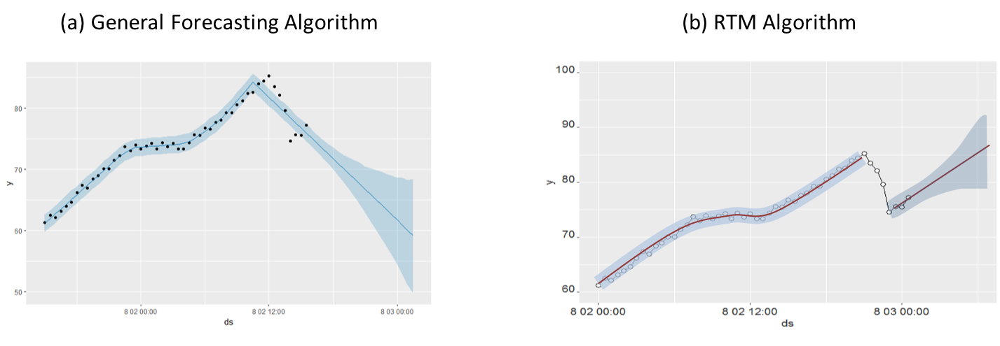

**NexClipper’s Robust Trend Forecasting (RTF) Algorithm for Disk-Full Time Estimation**

**Why disk-full monitoring is important?** Disk capacity is one of the most important indicators that we need to monitor preferentially, although often overlooked and overtaken. In the case of CPU, it is common for a server not to fail even if they are used nearly 100%. However, if the disk is full, it will most likely to cause the server to fail.

<!--truncate-->

**Limitations of rule-based disk monitoring** Disk monitoring is often done by checking the status of the disk based on rules. For example, you might want to let us know when disk usage reaches 80% or more. However, these rule-based methods do not reflect the speed of disk usage growth. Therefore, we may not have enough time to fix the problem or increase the disk capacity. So we need an AI-based forecasting model to know when the disk will be full. Because most of the forecasting models reflect trend growth, you can approximate when the disk will be full if the current trend remains.

**Limitations of the general forecasting model** Most of the forecasting models give equal weights to all observations. Therefore, the actual value of the following figure (a) is estimated as (b).

 

 

In this case, the disk full point can be expected to appear significantly behind, and we can miss the severity of the problem as shown in the following figure.

 

 

As shown in the picture above, we can discern what could be disc-full in 3 hours as it will happen in 4 days.

**The necessity of a forecasting model that reflects the characteristics of disk usage limitations** The characteristics of disusage are as the following:

**** When the disk becomes free, it is initialized from that point (**Memoryless Property**) **** Most affected by recent processes (**Recency**)

**The characteristics of RTF algorithm** Since the amount of disk usage has the characteristics, as shown above, misuse of the general forecasting model can lead to erroneous results. Our NexClipper’s RTF algorithm provides robust forecasting results that reflect the characteristics of disk usage, as shown below.

 

 

Unless the memoryless property & recency property are reflected, most forecasting methods produce false prediction results as shown in (a) below. However, because our RTF algorithm can reflect recent process usage and the results of disk-free activities, the forecasting result (b) is more reasonable than general forecasting methods (a).

 

