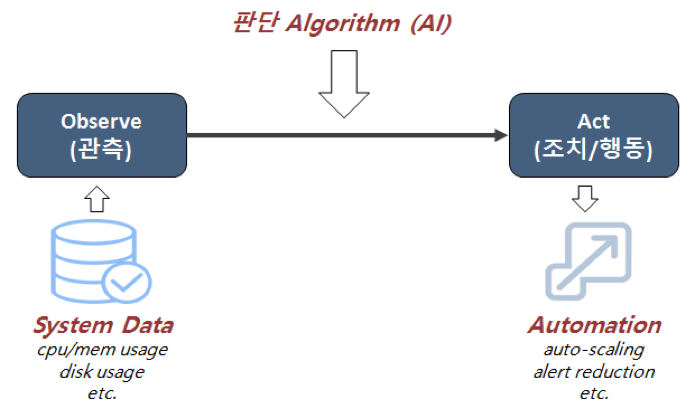

As IT operations have rapidly evolved for the decades, the gigantic amount of data involved with your application infrastructure is almost incomprehensive. In order for organizations to deal with this, they started to keep an eye on AIOps(Artificial Intelligence for IT Operations) which leverages AI to IT Operations.

<!--truncate-->

AIOps is used for big data analytics, Machine Learning, and other Artificial Intelligence to automate data collection, processing, and analysis from various sources. It benefits organizations in various ways: productivity improvement at work, stable and predictable infrastructure operation and, of course, cost-saving and business stability.

**Improve Performance at Work**

- Automation of routine tasks: No need to deal with repetitive and time-consuming tasks, meaning operators can focus more on technical related tasks.
- Eliminating the skills gap: solutions for interrupted services provided by DevOps engineers are available for new team members to handle operations and prevent service failures.

**Stable and Predictable Infrastructure Operation**

- Preemptive analysis: predict algorithm based resource usage and anomaly detection.
- Proactively detect problems through smart correlations and root-cause analysis.
- Prescribed response: avoid interrupted services base on root cause remediation, manage repetitive event alarm.

**A Cost-Effective Way to Operate Infrastructure**

- Resource optimization: analyze and predict resources usages to optimize resources; extra resources rearrangement leads to minimal resources utilization.
- Avoid service disruptions and eliminate firefighting: Intelligence that alerts to key approaching issues allows them to be proactively avoided such as financial damage.

**Maximize business stability and performance –DevOps Collaborations**

- Better collaboration and workflow activities between developers and operators, having the better understanding of what each team are doing with easier access to information and analyzed reports through a dashboard.
- Improve business responsiveness to service failures with root cause remediation by sharing accumulated data and analysis.

**Maximize business stability and performance - Better Customer Experience**

- Uninterrupted product availability, leading to a positive end-user experience.
- Improve product operations: reduce product development cycle; maximize business responsiveness regarding market trends.
- Provide application availability and eliminate customer frustration: Eliminate application slowdowns

With automation, your business is able to have routine tasks automated, meaning no need to work on mundane, routine, every alert anymore.  It gives you a huge time-saving opportunity to focus more on technical related works such as infrastructure and process. It also handles with the skills gap in that you have easier access to data with built-in intelligence allowing doing what they have to do; making key decisions for current experts, working on learning process for newer members of the team.

Second, it helps them prevent damages, leading stable and predictable infrastructure operation, thanks to its ability to prescribe response which includes preemptive problem solving and problems detection though smart correlation, clustering of alerts and root-cause remediation. As it is automated, it reduces alert volumes and eliminates operational noise as well.

It is a cost-effective way to operate infrastructure. This is because it allows you to utilize minimal resources to operate infrastructure. With resource optimization, operation costs can be reduced. Service disruptions can also be avoided, causing enormous financial damages with anomaly detection.

When it comes to business aspects, it allows better collaboration and cooperation as it helps IT team communicate with other business units without data silos. Making data-driven decisions allow your business to stay up to date with emerging trends. On top of that, it also improves business stability in that you can build positive relationships with end-user with uninterrupted product ability with continuous monitoring and no end-user frustration without slowdowns.

**The reality of AIOps and NexClipper AIOps**

Even though it has enormous benefits, business don’t make good use out of it. This is mainly because it requires system, analysis logic/algorithm and automation system for process throughout data collection, storage, monitoring, judgment algorithm, and action. (refer shown in the figure below)

Therefore, for software companies focusing on only few monitoring systems, they have difficulties in transforming to AIOps such as absent of platform and algorithm expert. However, NexClipper has pursued AI analysis since it was invented, it keeps developing data collection and algorithm for AIOps. For now, algorithms have invented that preemptive algorithms for judgment, anomaly detection (root-cause remediation) and root cause analysis. More specifically, those that predict when the disk is going to be full. Our goal is to expand those algorithms capabilities in order to apply AIOps to the automation system, acting more like a “Brain”.

