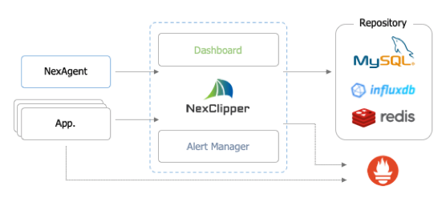

<!--truncate-->

**Kubernetes Monitoring with NexClipper**

Kubernetes is an orchestration tool that automates the deployment, management and auto scaling of containerized applications. It avoids you from doing labor intensive and time-consuming tasks as Kubernetes offers the following capabilities:

- Automatic deployment of application services
- Automatic configuration of application network
- Auto bin packing
- Automatic rollouts and rollbacks
- Resource application for application services
- Distribution of services across infrastructure
- Scale out application services
- Load balancing between application components

…

**Background:**

**1\. DevOps culture**

Developers are required to have the ability to integrate app and business-related metrics because they can do a lot of operations related works on their own. Therefore, monitoring needs to be more accessible and covers additional layers of the stack.

**2\. Container and Kubernetes**

As Container –based infrastructure changes because of logging, debugging, high-availability, monitoring is also changing rapidly. New approach is needed to manage volatile software entities, services which can’t be dealt with traditional monitoring tools.

….

**What to Monitor?**

Monitoring Kubernetes is inevitable to understand application health.

- Resource: Resource monitoring is necessary to find out clusters and applications health.

- Disk_:_ Monitoring the percentage of disk in use is more relevant than the volume of disk usage because the thresholds of concern have nothing to do with the size of your clusters.

- CPU: CPU monitoring is available through Kube-state-metrics. It will show you system, user consumption, and iowait as well.

- Memory: Memory monitoring is available through Kube-state-metrics. It will represent how much memory is available and in use.

- Pod: Monitoring the health of pod deployments are needed to make sure if Kubernetes works properly. Once the Kubernetes scheduler identifies what resources a pod need, it can then place pods on nodes where the resources are available.

- Network: Even though we are living in the era of gigabit interfaces, we can still run out of bandwidth. It is crucial for you to be aware data consumption and the patterns of the application usage to keep costs down.

**\[Prometheus Architecture\]**

(Source: google.com)

Metrics that are not supported in Prometheus format such as MySQL, Nginx, Redis, Kafka, etc) are required to install an exporter to be converted into Prometheus formatted metrics. Otherwise, Pushgateway which is another component collecting metrics. Alertmanager is responsible for alerting and Grafana is required for dashboard.

…

**Monitoring Kubernetes using Prometheus –Drawbacks**

**– Limited visibility**

Since Prometheus provides limited visibility, you can only get limited information. It is both challenging and time consuming when resolving the problem with an application. As you can see in the Prometheus architecture, people are required to install Grafana for dashboard which is cumbersome.

**\-Lack of storage**

Prometheus built-in storage does not offer durable long-term storage, anomaly detection, and user management.

**\[NexClipper Architecture\]**

…

**Monitoring with NexClipper**

NexClipper deals with those weaknesses of Prometheus in that it includes 2 databases; Influx DB and Prometheus. NexClipper includes InfluxDB as default which has high availability of long-term storage and machine learning but also Prometheus to install third party exporters as well. As NexClipper has Prometheus for third party exporters, you can customize it as needed.

- **Easy setup and maintenance**

With NexClipper, Kubernetes monitoring is as simple as installing an agent. You only need NexAgent which is a fully integrated agent to replace Node Exporter, cAdvisor, and Kube-state metrics.

Prometheus set up requires many different components such as Grafana and third-party exporters to work properly. NexClipper, on the other hand, is a Software-as-a-Service (SaaS) meaning that the set up and maintenance efforts are nearly zero – it is available in 3 minutes.

- **User management (User Friendly)**

NexClipper provides out-of-the-box user management including inviting your team members to the service.

- **Straightforward/ Intuitive use**

NexClipper is pretty straightforward to use especially for installing and it has also intuitive UI which allows you to get full stack visibility for everything running on a cluster. It monitors dashboards throughout whole sections from service to host server without Grafana.

- **Leverage Prometheus (in the near future)**

NexClipper extends to give more options to monitor Kubernetes for your convenience by leveraging Prometheus. If you prefer Prometheus, you could still use it by simply installing it. You can also save data in Prometheus if you want. On top of that, you can customize connect third party applications that also can be seen on NexClipper as well.

Try NexClipper. It’s open source for Kubernetes monitoring.

[https://github.com/NexClipper/NexClipper](https://github.com/NexClipper/NexClipper)

