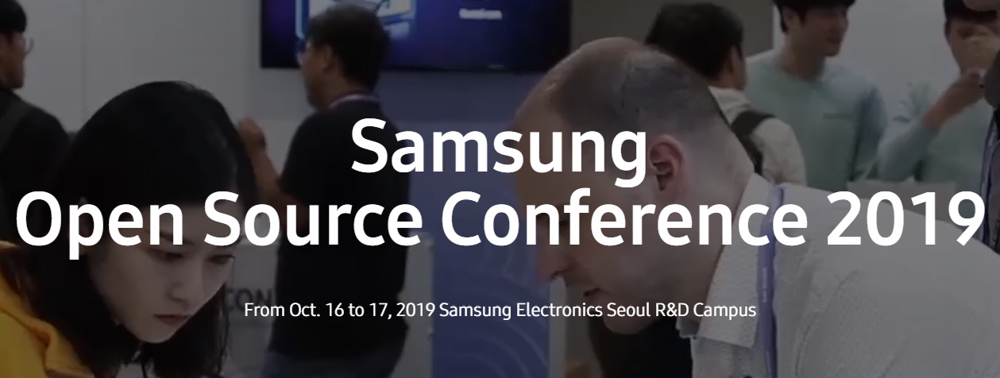
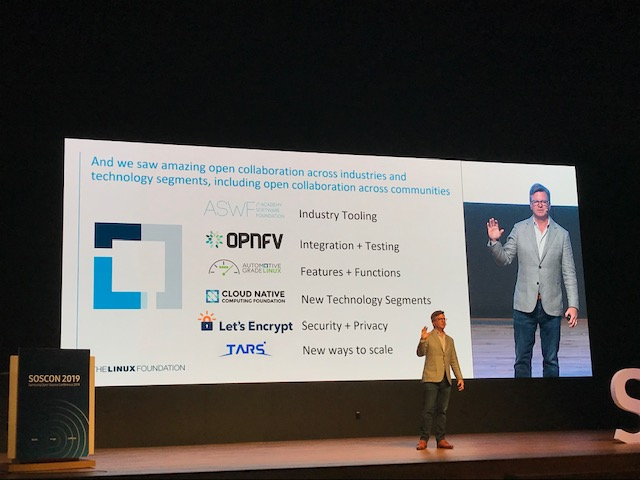

 
<!--truncate-->
 

- 2,000+ Participated at the Event, Sharing Knowledge & Experience in Open Source
- 500+ Visited Us, to See NexClipper
- We’re Coming to Munich, San Diego and Seoul for Major Conferences and Events in November and December, 2019. Come See Us!

Samsung Open Source Conference (a.k.a. SOSCON) 2019 was held from Oct. 16 to 17, 2019, at Samsung Electronics Seoul R&D Campus. Marking 6th conference this year, 2,000+ software developers participated to share their knowledge and experience in open source, linking the hottest technology trends such as Next-Generation Communication, Linux Ecosystem, Robotics, AI, IoT, Big Data and etc. SOSCON is one of the largest open source conference events held in South Korea where leaders and professionals in the field of open source communicate and share insights each other.

 

We, NexClipper, participated at the event as an exhibitor to introduce our NexClipper project, an open source cloud-native program which is to bring monitoring interoperability and insights on metrics.

 

 

 

500+ developers, professionals, and students visited us to take a look at our NexClipper, and we enjoyed this opportunity to share the vision and direction of our project together. We also distributed swag (coasters) for our friends to take home. We truly appreciate all of you who visited us saying hello, and we wish to come to SOSCON 2020 again!

 

 

As NexClipper is on its way, you will find us more often at major conferences and events being held in many different locations in near timelines, such as PromCon 2019 (in November, Munich), KubeCon + CloudNativeCon North America 2019 (in November, San Diego), and Kubernetes Forum 2019 (in December, Seoul). We look forward to meeting you all!

In the mean time, please come see the progress of NexClipper project at:

Our Website: [www.nexclipper.io](http://www.nexclipper.io)

GitHub Page: [github.com/nexclipper/nexclipper](http://github.com/nexclipper/nexclipper)