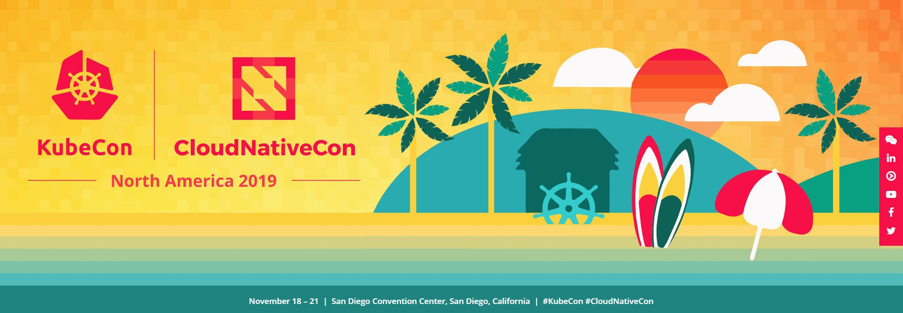

NexClipper is exhibiting at KubeCon + CloudNativeCon North America - 2019 taking place at San Diego Convention Center throughout November 18 to 21, 2019 (we're only 3 nights away).

<!--truncate-->

This is going to be an exceptional experience for us to show up at one of the major Open-Source  & Cloud-Native conference scenes in the world.

We will introduce our NexClipper project, 'the New Open Source project to deliver production-ready Prometheus in enterprise environment,' and we would be more than happy to share ideas and listen to your opinions!

Please come and say hi to us! Let's discuss our interest in NexClipper project during the exhibition.

+, Get all-new NexClipper stickers and swag from our booth!

 

See you soon!
