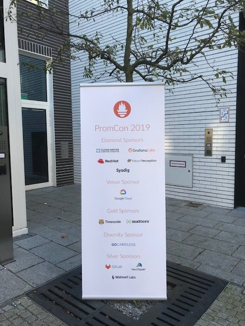
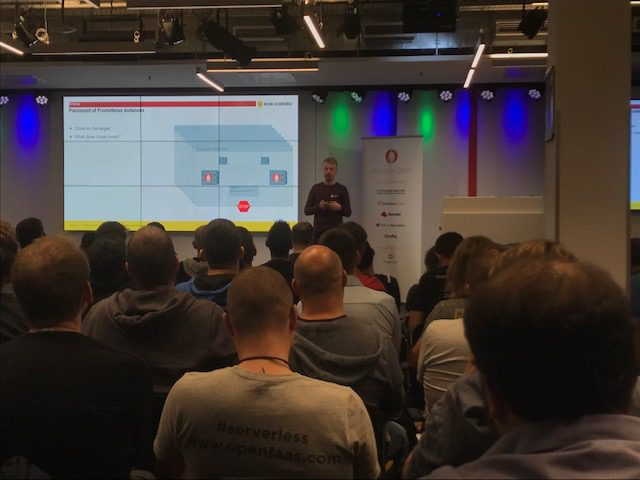
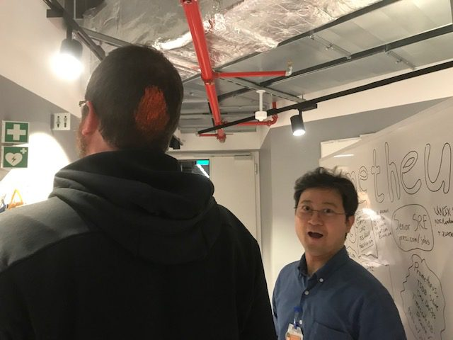
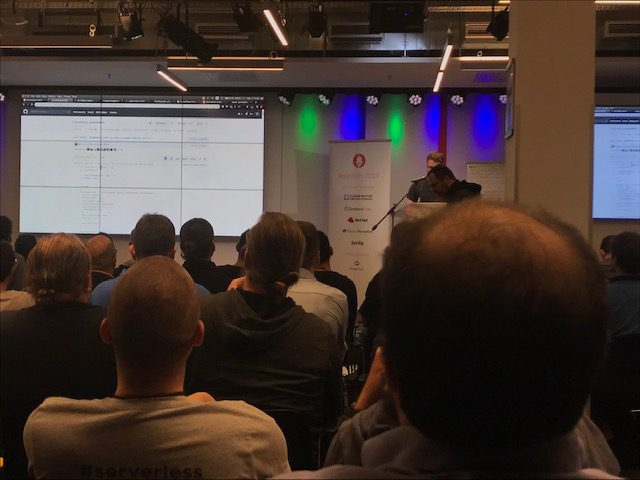
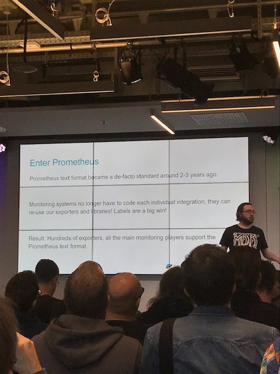
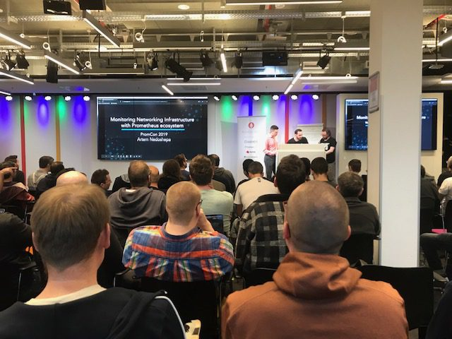
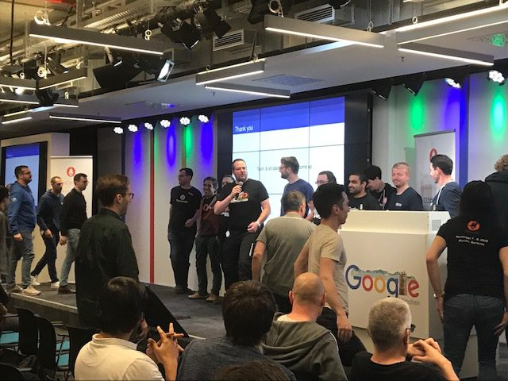
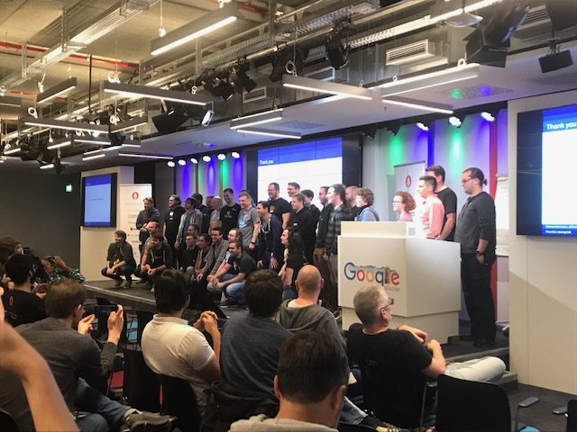
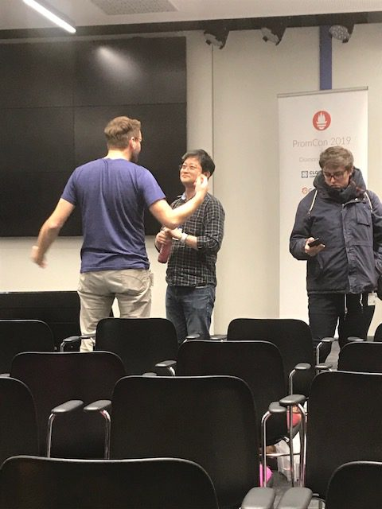
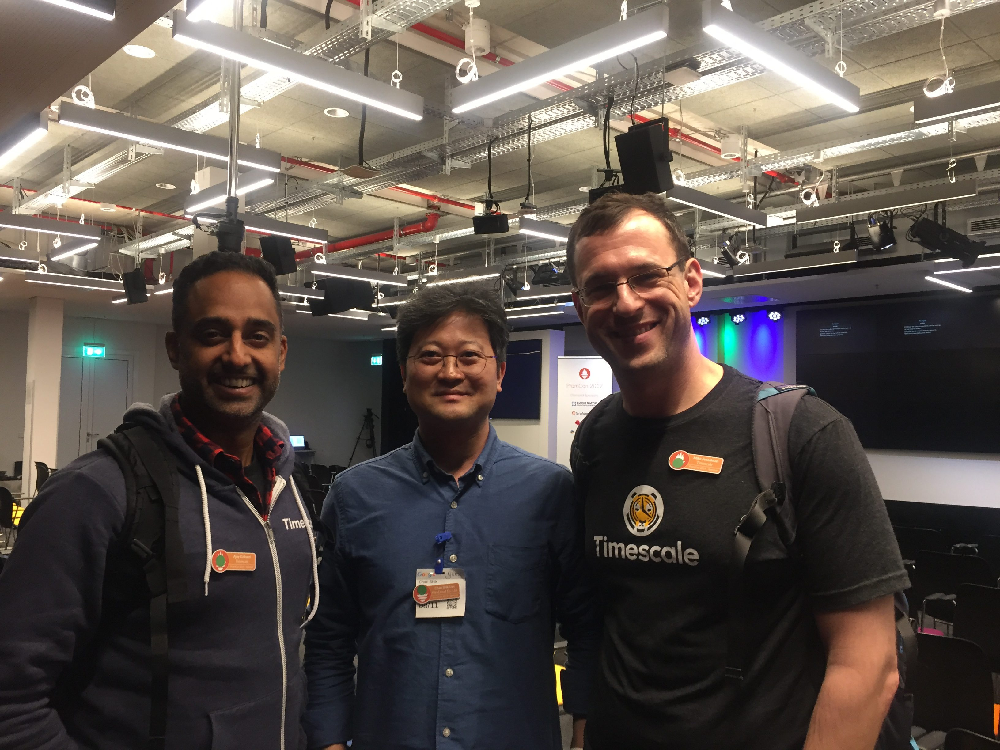

We are now back to Seoul writing a brief post-event report on our attendance to PromCon EU 2019 held in Munich, on Nov. 07 & 08, 2019.

- Presented NexClipper as Silver Sponsor of the Event
- 200+ Participated to Share Insights, Experience and Ideas around Prometheus
- Upcoming: NexClipper will be Exhibiting at KubeCon + CloudNativeCon North America, San Diego (Nov. 18 to 21, 2019). Anyone Coming? Let's Meet!

Purpose of PromCon is to connect users, developers, and contributors from around the world to share knowledge, experiences, ideas around Prometheus.

NexClipper contributed as a Silver Sponsor for this year's event marking 4th conference since 2016, and we would like to share what it was like to be at PromCon.

<!--truncate-->

- NexClipper Sponsoring the Event

- The event organizer, Richard "RichiH" Hartmann opens the event with welcome statements.

- Jumping in to the Sessions, as Scheduled.

- Prometheus Job Ads on Whiteboard!

- Swag - Prometheus Bowls, Stickers, Coasters, etc. (You can see NexClipper's Swag too!)

- Back on Tracks

- During Break Time, our CTO and "RichiH"

- Sessions: Sharing Knowledge, Experiences, Best Practices, Ideas, Suggestions

- Session: "OpenMetrics: What Does It Mean for You" by Brian Brazil, Robust Perception

- Lunch with Julius Volz. You probably heard about him if you're using Prometheus.

- Lightening Talks - Participants Talk their Ideas & Suggestions at the End of Each Event Day.

- Wrap-Ups

- Last Minute Chat - Sharing Ideas and Opinions

- Oh, Our Quick Meet Up with Timescale Co-Founders! Ajay (CEO) on the Left & Michael (CTO) on the Right.

To summarize, we were extremely excited sponsor & attend PromCon EU 2019. We could introduce our NexClipper project, meet up with good friends, share ideas and see where we are as well.

We look forward to the next!

...

Next Week! Come and meet us at our exhibition booth at KubeCon + CloudNativeCon North America 2019, San Diego (Nov. 18 to 21)!
