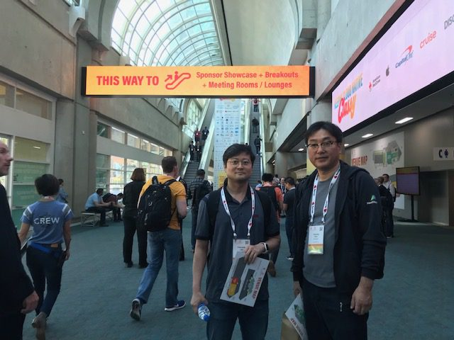
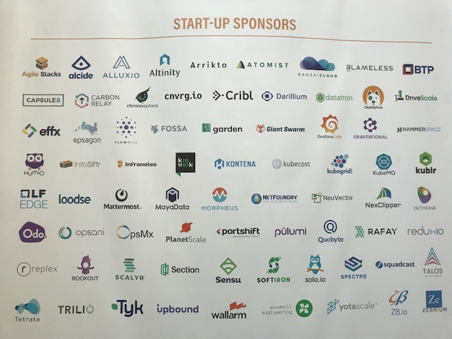
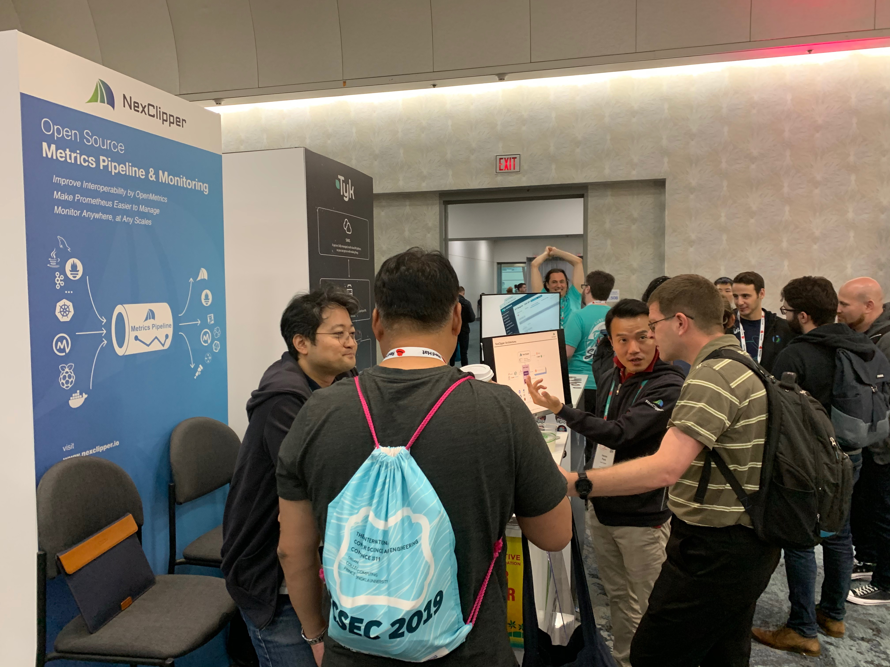
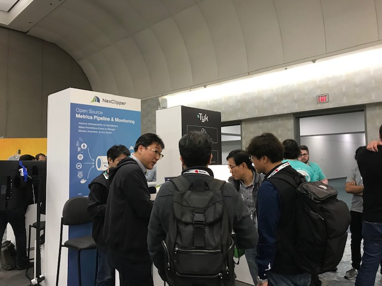

Now back to Seoul, Korea, we would like to wrap up and share what we gained out of exhibition at KubeCon + CloudNativeCon North America 2019 - San Diego (Nov. 18-21, 2019).

<!--truncate-->

\- You can find brief Demographic Data of the Event in below file.

[KCNA\_2019\_Initial\_Attendee\_Data](https://www.nexclipper.io/wp-content/uploads/2019/12/KCNA_2019_Initial_Attendee_Data.pdf)

\- 11,900+ Attendees Participated the Event - Top 3 Countries Represented: USA, Canada, Japan - top 3 Project Interests: Kubernetes, Prometheus, Helm

700+ visited our booth to see the concepts, ideas, progress & next steps of NexClipper project. (Surprisingly or not, we were the first and the only company from South Korea who happened to run a booth at KubeCon North America event!)

What we presented with NexClipper project was: an Open Source Project Aimed at Delivering Monitoring Interoperability and Production-Ready Prometheus in Enterprise Environments

Some key takeaway concepts and ideas from our booth we would like to highlight are:

in Progress: - Agent-Server way of piping metrics (= Metrics Pipeline) can help ease Prometheus monitoring needs in complex/closed network security settings. - NexClipper’s Metrics Pipeline guarantees interoperability with 3rd party monitoring solutions, efficiently securing insights as desired.

Upcoming: - NexClipper discovers, recommends and auto-installs the best-fit Prometheus exporter(s) for your monitoring needs. - Global yet cluster-selective viewing through NexClipper dashboard and long-term storage implementation enables enterprise-level monitoring.

we truly enjoyed this opportunity to share the vision and direction of our NexClipper project with you all.

We're working on our project in fast pace. In the meanwhile, to stay updated on the progress of our NexClipper project, please visit and follow us at:

Github: [https://github.com/NexClipper/NexClipper](https://github.com/NexClipper/NexClipper)
