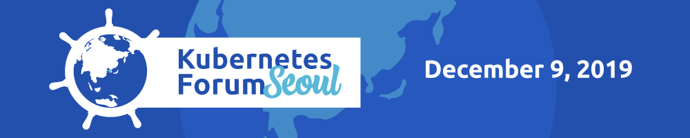
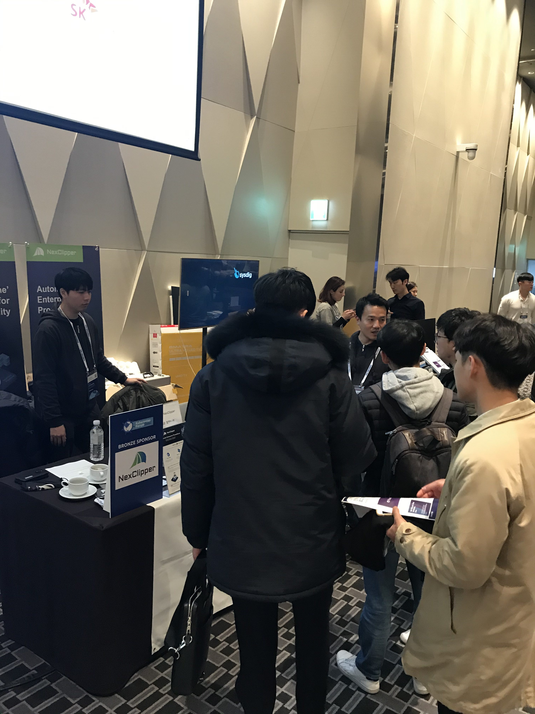

On Dec. 09, 2019, we exhibited at K8S Forum Seoul 2019 event held at Yongsan Dragon City.

We took this opportunity as a Bronze Sponsor of the event, and had 500+ attendees visited our booth.

We kept 2 takeaway messages of our NexClipper project on emphasis during the showcase:

1\. Delivering Monitoring Interoperability through 'Metrics Pipeline' 2. Delivering Production-Ready Prometheus in Enterprise Environments

We were glad to see growing interest towards and awareness on our NexClipper from our visitors! And we thank you all who showed up to us saying hello!

Besides our booth, our CTO, Chanshik also contributed to the event that he held a session titled 'Improving Monitoring Systems Interoperability with Prometheus & OpenMetrics,' and spoke in front of the audience of 400+ to share his experience & insights on the topic, in alignment with our project, NexClipper.

\- His keywords (Interoperability, Metrics Pipeline, OpenMetrics, Prometheus & etc.) sparked instantaneous interest and curiosity among the audience that we received a series of direct and specific questions on our NexClipper project, following Chanshik's sesison.

\- You can find his presentation contents in the below URL link: \[https://k8sforumseoul19eng.sched.com/event/WIR5/improving-monitoring-systems-interoperability-with-prometheus-openmetrics-chan-shik-lim-nexcloud\]

K8S Forum Seoul 2019 finalizes our external exhibition journey of the year, and we look forward to seeing you all again at major events in 2020!
