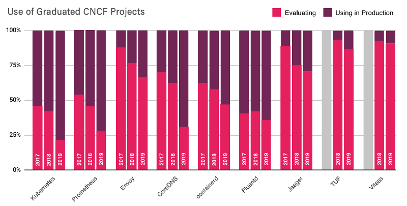

안녕하세요. 넥스클라우드 김진웅입니다.

지난 포스팅에서는 모니터링의 제공하는 가치와 자주 사용되는 용어를 정리해보고, 모니터링 대상과 메트릭 수집 방식에 대해서 정리해봤습니다. 이전 글 참고 : [Infrastructure Monitoring](https://www.nexclipper.io/infrastructure-monitoring/)

오늘은 프로메테우스는 어떤 오픈소스이고, 가지고 있는 장점과 단점들을 이야기 해보려고 합니다.

<!--truncate-->

프로메테우스는 2012년 SoundCloud에 의해 처음 개발 된 구글의 BrogMon에서 영감을 얻은 Go언어로 작성된 오픈소스 모니터링 도구입니다. 2016년 5월에 공식적으로 CNCF 재단에 가입한 두번째 프로젝트로써 2016년에 1.0 버전이 공개되었고, 2017년 말 새로운 스토리지 계층을 기반으로 하는 2.0 버전이 출시되어 2018년에 졸업(Graduated)한 컨테이너 플랫폼과 클라우드 플랫폼에 적합한 모니터링 프로젝트입니다.

현재 프로메테우스는 쿠버네티스 클러스터를 모니터링하는데 가장 널리 사용되는 도구중 하나입니다. 아래 그림(출처: [https://github.com/cncf/surveys](https://github.com/cncf/surveys))에서 볼 수 있듯이 졸업한 프로젝트중에 쿠버네티스 다음으로 70%이상 운영환경에서 가장 많이 사용하는 프로젝트입니다.



참고 : [https://www.cncf.io/wp-content/uploads/2020/03/CNCF\_Survey\_Report.pdf](https://www.cncf.io/wp-content/uploads/2020/03/CNCF_Survey_Report.pdf)

프로메테우스는 다른 오픈소스 모니터링 시스템과의 가장 큰 차이은 간단한 텍스트 기반 형식으로 다른 시스템에서 메트릭을 쉽게 얻을 수 있다는 것입니다. 기본적으로 시계열 기반 오픈소스 시스템으로 익스포터(exporter)와 같은 메트릭 엔드포인트나 서비스에 HTTP 요청을 통해 다음에 다룰것이지만 카운터(Counter), 게이지(Gauge), 히스토그램(Histogram)및 서머리(summary)와 같은 다차원 데이터 모델을 수집하고 쉽고 간결하지만 풍부하게 활용할 수 있는 쿼리 언어(PromQL)를 제공하고 있습니다.

실제로 프로메테우스를 사용하면 모든 레벨의 인프라, 노드, 쿠버네티스를 포함한 컨테이너 스케줄링 시스템, 라우터 및 스위치와 같은 네트워크 장비까지 모니터링 할 수 있습니다. 큰 애플리케이션을 다루고 빠르게 변화하는 인프라 환경에서 프로메테우스는 서비스를 발견(discover)하는 능력이 있기 때문에 매우 유용합니다. 동적으로 변화하는 인프라가 있는 경우 프로메테우스를 사용하여 초기 장애를 빨리 감지하고 전체 스택에서 진행중인 작업을 확인할 수 있습니다. 책임 소재에 대한 부분이라 민감한 주제일지 모르지만 가장 중요한 부분 중 하나는 개발자나 운영자가 어떻게 그리고 왜 문제가 발생했는지 조사하는 데 도움이 됩니다. 하지만 프로메테우스는 로그를 생성하는 데 적합하지 않습니다. (최근 Grafana 에서 [Loki](https://github.com/grafana/loki) 라는 프로메테우스 스타일의 경량 로깅 솔루션을 내놓기도 했습니다. 이 내용은 개인 블로그에 따로 작성해 볼 예정입니다.)

### 프로메테우스가 가지는 장점

Prometheus 기존 모니터링 시스템의 알림 모델과 많이 다른 모습을 가지고 있습니다. 중앙 집중식으로 집계, 계산하고 알림을 생성하는 솔루션입니다.

분명 이글을 보고 계신다면 한번 이상은 방문해 보셨을거라 생각하는 [공식 웹페이지](https://prometheus.io/docs/introduction/overview/)에 가셔도 기능과 컴포넌트에 대한 정리가 잘 되어 있습니다. 기존 모니터링 시스템과 비교하여 다음과 같은 장점들을 가지고 있습니다.

### 관리의 용이성

프로메테우스는 관리가 편하다는 것이 가장 핵심입니다. 별도의 설치없이 바이너리 파일 하나로 동작하기 때문에 기본적으로 로컬디스크만 있으면 되고 데이터베이스나 캐시와 같은 다른 솔루션과의 종속성이 거의 없습니다.

그리고 풀(Pull) 방식의 아키텍처를 기본으로 하기 때문에 로컬, 개발환경, 테스트환경 어디서나 편하게 구성이 가능합니다. 쿠버네티스와 같은 복잡한 환경에서는 서비스 디스커버리(Service Discovery) 기능을 사용하여 대상을 동적으로 관리가 가능합니다.

### 강력하고 쉬운 데이터 모델과 쿼리 언어(PromQL)

수집 된 모든 모니터링 데이터는 기본 제공되는 시계열 데이터베이스(TSDB)에 메트릭 형식으로 저장됩니다. 그리고 기본 이름 외에도 모든 샘플에는 샘플의 특성을 설명하는 태그 세트가 포함되어 있습니다.

각 시계열 데이터는 메트릭 이름과 옵션인 레이블이라 부르는 키-밸류 쌍으로 고유하게 식별됩니다. 옵션 값으로 가집니다. 각 시계열 데이터는 일련의 샘플 값을 시간 순서대로 저장합니다.

각 샘플은 float64 값과 밀리세컨드 수준의 타임스탬프로 구성됩니다.

데이터 표기법(PromQL)

```
<metric name>{<label name>=<label value>, ...}
```

잠깐 Expression language data types 정리

- 인스턴트 벡터(Instant vector) 인스턴트 벡터는 셀렉터와 일치하는 시계열 데이터에 대한 쿼리 시점의 결과이기 때문에 인스턴트 벡터라고 부릅니다. 시계열에 함수를 적용하거나 작업이 수행되는 경우, 인스턴트 벡터 샘플의 타임 스탬프는 수집된 시간이 아니라 쿼리 시점의 시간을 반영합니다. 푸시 게이트웨이(Push Gateway)로 푸시된 메트릭은 제외됩니다. [RE2 syntax](https://github.com/google/re2/wiki/Syntax)와 연산자(operator), 레이블 매처(matcher)를 사용하여 정규표현식으로 쿼리가 가능합니다.

```
http_requests_total{environment=~"staging|testing|development",method!="GET"}
```

- 레인지 벡터(Range vector) 인스턴트 벡터와 유사하지만 주어진 시간 범위의 시계열 데이터 샘플 셋을 반환합니다. 보통 PromQL에서 흔히 사용하는 \[1m\] 표현과 같이 대괄호를 사용하여 시간 범위를 설정합니다. 초(s), 분(m), 시간(h), 일(d), 주(w), 연(y) 단위로 사용이 가능합니다. 아래 예제를 보면 HTTP response 코드 200에 대한 2분 동안 수집된 샘플을 확인할 수 있습니다. 만약 스크레이핑(scrape) 간격이 15초일 경우 총 4번의 샘플링이 되기 때문에 4개의 샘플이 반환됩니다.

```
http_requests_total{code="200"}[1m]
```

- 스칼라(Scalar) 차원없이 숫자(floating point value)로 구성된 값
- 문자열(String) 현재 미사용

PromQL을 조금 더 자세히 살펴 보겠습니다.

```
rate(http_requests_total{job="apiserver", handler="/api/comments"}[5m])[30m:1m]
```

위 예시로 정리해보면 http\_requests\_total 라는 메트릭 이름과 job=”apiserver”, handler=”/api/comments” 라고 쓰여진 시계열 데이터를 셀렉트해서 5분 범위내의 시계열 샘플을 rate(초당 평균 변화율)값으로 계산한 다음, 1분 해상도로 지난 30분 동안의 데이터를 보여달라는 의미입니다.

설명이 다소 어렵지만 꼭 이해하고 넘어가면 시계열 데이터에 대한 이해와 활용도가 커질거라 생각됩니다.

보통 이런 쿼리를 일반적인 SQL문으로 작성하게 되면 레이블값은 WHERE와 GROUP BY를 활용할 수 있지만 나머지 값들은 작성이 쉽지 않거나 불가능할 수도 있습니다.

또한 이러한 레이블과 시계열을 기반으로 모니터링 데이터를 쉽게 쿼리하고 집계할 수 있습니다. 또한 PromQL은 그라파나(Grafana)와 같은 데이터 시각화나 알림(alert, notification)에도 사용됩니다.

참고 : 프로메테우스 쿼리 [https://prometheus.io/docs/prometheus/latest/querying/basics/](https://prometheus.io/docs/prometheus/latest/querying/basics/)

### 풀(Pull) 수집 방식으로 인한 내부 상태 모니터링

프로메테우스는 사용자가 직접 서비스의 내부 상태를 모니터링 하도록 권장합니다. 이는 이전 포스팅에도 언급 했던 것처럼 블랙박스 모니터링처럼 내부 상태를 모르는것 보다는 다양한 클라이언트 라이브러리나 익스포터를 사용하여 실제 애플리케이션 또는 솔루션의 메트릭 상태를 확인이 가능합니다.

### 프로메테우스가 가지는 단점

프로메테우스는 다음과 같은 것들을 포함하지 않는 것을 단점이라고 이야기합니다. 각 내용 별 대안 솔루션은 링크를 참고하시기 바랍니다.

- 원시 로그 / 이벤트 수집 : [Loki](https://grafana.com/oss/loki/), [Elastic Stack](https://www.elastic.co/kr/elastic-stack)
- 요청 추적(Request Tracing) : [OpenMetrics](https://openmetrics.io/), [OpenTelemetry](https://opentelemetry.io/)
- 이상 감지(Anomaly Detection)
- 장기 보관 및 고가용성 (Long-term Storage, HA) : [M3](https://www.m3db.io/), [Cortex,](https://www.weave.works/oss/cortex/) [Thanos](https://thanos.io/)
- 스케일링(horizontal scaling)
- 사용자 인증 관리

하지만 많은 회사들이 위와 같은 기능들을 추가하여 엔터프라이즈 기반 매니지드 서비스를 출시하거나 컨설팅 서비스를 수행하고 있습니다.

저희 회사에서도 매니지드 프로메테우스 서비스를 준비중에 있습니다.

참고 : [https://prometheus.io/support-training/](https://prometheus.io/support-training/)

### 정리

이번 포스팅에서는 프로메테우스 오픈소스의 장단점을 이야기해봤습니다.

다음 포스팅에서는 프로메테우스에서 사용하는 데이터 모델과 메트릭 타입들을 소개하고 샘플링과 집계에 관련된 이야기를 해보려고 합니다.

블로그 내용을 포함한 저희의 모든 기술과 제품에 대한 다양한 피드백 부탁드립니다.

### 관련글

[Infrastructure Monitoring](https://medium.com/nexclipper-io/infrastructure-monitoring-9449ef2791dd)

### 넥스클라우드 소개 및 채용

[넥스클라우드](https://www.nexclipper.io)는 컨테이너 기반 클라우드 기술 회사입니다.

2020년 하반기부터 본격적인 글로벌 사업을 위해 현재 미국 법인 설립을 진행 중이며 능력있는 분들을 모시고 있습니다.

[Product Marketing Manager](https://www.notion.so/nexclipper/Job-description-63e5113b79a943f28a75c1eca1e0f50a)
