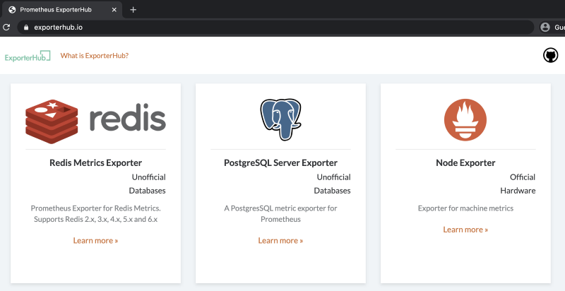

Today, I'm going to explain about the Prometheus exporter.

<!--truncate-->

### Prometheus ecosystem components

Prometheus is basically instrumenting the metrics of an application or a third-party system (service), which is usually scraped through the target endpoint.

- Prometheus default port allocations : [https://github.com/prometheus/prometheus/wiki/Default-port-allocations](https://github.com/prometheus/prometheus/wiki/Default-port-allocations)

Not all applications or services generate Prometheus compatible metrics. Therefore, collection targets that are Prometheus targets can be collected in the format of client libraries and exporters.

### Client Library

The best way to set up monitoring when developing service is to use the Prometheus client library to write and instrument metrics directly based on code inline.

By default, Go, Java (Scala), Python, and Ruby provide official libraries.

- Client Library : [https://prometheus.io/docs/instrumenting/clientlibs/](https://prometheus.io/docs/instrumenting/clientlibs/)

Since unofficial libraries are run by users in the community, they can also be a problem with code maintenance, so you should always use them while checking the release information.

### Exporter

Exporters can expose metrics from packaged software or third-party systems (services) where code cannot be modified directly. Usually, vendors or service companies expose metrics directly, but a separate exporter is required to instrument software such as the Linux system kernel, network equipment, storage, and databases.

Almost all services are provided by the community and users, and you can check the status of exporters from the link below.

- Exporter : [https://prometheus.io/docs/instrumenting/exporters/](https://prometheus.io/docs/instrumenting/exporters/)
- [ExporterHub.io](http://exporterhub.io) : Exporter catalog page recently released by NexCloud

### Using the Client Library

I'm going to show a simple example of using the client library. The code was used earlier in Spinnaker based Canary deployment test.

- Python client library : [https://github.com/prometheus/client\_python](https://github.com/prometheus/client_python)

Let's take a quick look at the code. The `app.py` was written based on Python Flask, and with the `prometheus_client` library added,  I used `start_http_server` for the metric HTTP endpoint (:8080).

Simply generate the internal 500 error in the desired ratio and to confirm an artificial metric, create `success_rate` variable and configure a simple metric server(:8000) to instrumentate with  `Gauge`, `Counter`.

To check the `Counter` metric type, set the label to `http_code='500'`, `http_code='200'`.

Finally, to declare it as a `Gauge` metric type, add a code of g.set(rate_responce).


> Exposed endpoints and exporters may be set to different paths, as shown above, but use the /metrics path as usual. ex) [http://localhost:8000/metrics](http://localhost:8000/metrics)

```python
#!/usr/bin/env python
from random import randrange 
from flask import Flask 
from prometheus_client import start_http_server, Gauge, Counter 
import sys

app = Flask('python-library-test') 
c = Counter('requests', 'Number of requests served, by http code', ['http_code']) 
g = Gauge('rate_requests', 'Rate of success requests')

responce_500 = 0 
responce_200 = 0 
rate_responce = 0 
success_rate = sys.argv[1] # Input variable to generate an internal 500 error at the desired rate

@app.route('/')
def hello(): 
    global responce_500 
    global responce_200 
    global rate_responce 
    if randrange(1, 100) > int(success_rate): 
        c.labels(http_code='500').inc() 
        responce_500 = responce_500 + 1 
        rate_responce = responce_500 / (responce_500+responce_200) * 100 
        g.set(rate_responce) 
        return "Internal Server Error\\n", 500 else: 
        c.labels(http_code='200').inc() 
        responce_200 = responce_200 + 1 
        rate_responce = responce_500 / (responce_500+responce_200) * 100 
        g.set(rate_responce) 
        return "Hello World!\\n"

start_http_server(8000) 
app.run(host = '0.0.0.0', port = 8080)
```

It is for testing purposes, let’s simply run locally.

```sh
$ pip install flask prometheus_client
$ python app.py 50 # Input variable to generate an internal 500 error at the desired rate
 * Serving Flask app "python-library-test" (lazy loading)
 * Environment: production
   WARNING: This is a development server. Do not use it in a production deployment.
   Use a production WSGI server instead.
 * Debug mode: off
 * Running on <http://0.0.0.0:8080/> (Press CTRL+C to quit)
```

In order to collect the metrics, we simply use the `ab` command and make repeated calls.

```sh
$ ab -n 1000 http://localhost:8080/
...
Server Software:        Werkzeug/1.0.1
Server Hostname:        localhost
Server Port:            8080

Document Path:          /
Document Length:        22 bytes

Concurrency Level:      1
Time taken for tests:   1.775 seconds
Complete requests:      1000
Failed requests:        0
Non-2xx responses:      505
...
```

Requests, Non-2xx responses should be looked at in detail in the results.

Because an error was generated by making 1000 requests with a 50% probability of the input factor, success can be confirmed as 495 times and errors 505 times.

Let's try connecting to the exposed port 8000 to check the metrics.


```sh
$ curl localhost:8000
# HELP python_gc_objects_collected_total Objects collected during gc
# TYPE python_gc_objects_collected_total counter
python_gc_objects_collected_total{generation="0"} 18055.0
python_gc_objects_collected_total{generation="1"} 2461.0
python_gc_objects_collected_total{generation="2"} 0.0
# HELP python_gc_objects_uncollectable_total Uncollectable object found during GC
# TYPE python_gc_objects_uncollectable_total counter
python_gc_objects_uncollectable_total{generation="0"} 0.0
python_gc_objects_uncollectable_total{generation="1"} 0.0
python_gc_objects_uncollectable_total{generation="2"} 0.0
# HELP python_gc_collections_total Number of times this generation was collected
# TYPE python_gc_collections_total counter
python_gc_collections_total{generation="0"} 82.0
python_gc_collections_total{generation="1"} 7.0
python_gc_collections_total{generation="2"} 0.0
# HELP python_info Python platform information
# TYPE python_info gauge
python_info{implementation="CPython",major="3",minor="8",patchlevel="3",version="3.8.3"} 1.0
# HELP requests_total Number of requests served, by http code
# TYPE requests_total counter
requests_total{http_code="500"} 505.0
requests_total{http_code="200"} 495.0
# HELP requests_created Number of requests served, by http code
# TYPE requests_created gauge
requests_created{http_code="500"} 1.5990454944853382e+09
requests_created{http_code="200"} 1.599045494488697e+09
# HELP rate_requests Rate of success requests
# TYPE rate_requests gauge
rate_requests 50.5
```

If you look at the `http_code='500'` and `http_code='200'`, `Counter` that I wrote, you can see that it is the same metric I checked in `ab`.

And if you look at rate_requests set with `Gauge`, you can see that the success rate is 50%.

### Use Exporter

I am currently using macOS and want to use node_exporter to check host metrics.

- node\_exporter : [https://github.com/prometheus/node\_exporter](https://github.com/prometheus/node_exporter)

node_exporter is an exporter officially provided by the Prometheus community and I’ll try to simply run it by receiving a binary.

Search node_exporter at [ExporterHub.io](http://exporterhub.io/), which was provided recently by NexCloud as a curation page for community users.



[https://github.com/NexClipper/exporterhub.io/blob/master/lists/node/README.md](https://github.com/NexClipper/exporterhub.io/blob/master/lists/node/README.md)

Referring to the linked readme page above, run node_exporter locally on macOS. Since it is in binary, it can be run as a container, but on macOS, there was an issue with the host network, so I ran it myself.

```
$ wget  https://github.com/prometheus/node_exporter/releases/download/v1.0.1/node_exporter-1.0.1.darwin-amd64.tar.gz
$ tar -xzf node_exporter-1.0.1.darwin-amd64.tar.gz
$ cd node_exporter-1.0.1.darwin-amd64
$ ./node_exporter
level=info ts=2020-09-02T12:31:03.309Z caller=node_exporter.go:177 msg="Starting node_exporter" version="(version=1.0.1, branch=HEAD, revision=3715be6ae899f2a9b9dbfd9c39f3e09a7bd4559f)"
level=info ts=2020-09-02T12:31:03.309Z caller=node_exporter.go:178 msg="Build context" build_context="(go=go1.14.4, user=root@4c8e5c628328, date=20200616-12:52:07)"
level=info ts=2020-09-02T12:31:03.309Z caller=node_exporter.go:105 msg="Enabled collectors"
level=info ts=2020-09-02T12:31:03.309Z caller=node_exporter.go:112 collector=boottime
level=info ts=2020-09-02T12:31:03.310Z caller=node_exporter.go:112 collector=cpu
level=info ts=2020-09-02T12:31:03.310Z caller=node_exporter.go:112 collector=diskstats
level=info ts=2020-09-02T12:31:03.310Z caller=node_exporter.go:112 collector=filesystem
level=info ts=2020-09-02T12:31:03.310Z caller=node_exporter.go:112 collector=loadavg
level=info ts=2020-09-02T12:31:03.310Z caller=node_exporter.go:112 collector=meminfo
level=info ts=2020-09-02T12:31:03.310Z caller=node_exporter.go:112 collector=netdev
level=info ts=2020-09-02T12:31:03.310Z caller=node_exporter.go:112 collector=textfile
level=info ts=2020-09-02T12:31:03.310Z caller=node_exporter.go:112 collector=time
level=info ts=2020-09-02T12:31:03.310Z caller=node_exporter.go:112 collector=uname
level=info ts=2020-09-02T12:31:03.310Z caller=node_exporter.go:191 msg="Listening on" address=:9100
level=info ts=2020-09-02T12:31:03.310Z caller=tls_config.go:170 msg="TLS is disabled and it cannot be enabled on the fly." http2=false
```

Basically, as mentioned above, there are reserved port information and node_exporter exposed to /metrics endpoint, so try to access http://localhost:9100/metrics. You can check the machine metrics of the MacBook currently in use.

```python
$ curl http://localhost:9100/metrics
...
# HELP node_cpu_seconds_total Seconds the cpus spent in each mode.
# TYPE node_cpu_seconds_total counter
node_cpu_seconds_total{cpu="0",mode="idle"} 25639.47
node_cpu_seconds_total{cpu="0",mode="nice"} 0
node_cpu_seconds_total{cpu="0",mode="system"} 6361.26
node_cpu_seconds_total{cpu="0",mode="user"} 12627.86
node_cpu_seconds_total{cpu="1",mode="idle"} 37124.82
node_cpu_seconds_total{cpu="1",mode="nice"} 0
node_cpu_seconds_total{cpu="1",mode="system"} 2697.6
node_cpu_seconds_total{cpu="1",mode="user"} 4805.51
node_cpu_seconds_total{cpu="2",mode="idle"} 26546.08
node_cpu_seconds_total{cpu="2",mode="nice"} 0
node_cpu_seconds_total{cpu="2",mode="system"} 5505.62
node_cpu_seconds_total{cpu="2",mode="user"} 12576.23
node_cpu_seconds_total{cpu="3",mode="idle"} 37708.71
node_cpu_seconds_total{cpu="3",mode="nice"} 0
node_cpu_seconds_total{cpu="3",mode="system"} 2413.04
node_cpu_seconds_total{cpu="3",mode="user"} 4506.18
...
```

Since the process of linking with Prometheus is a setting change, I will not mention it here.

### ExporterHub.io

[ExporterHub.io](http://exporterhub.io/) was created for Prometheus community users, and was created for the purpose of providing a curation list similar to the awesome project.

Not only curation information but also simple installation guide, alert-rule setting, and dashboard related information can be viewed at once.

The roadmap for the future is as follows.


* Create alert-rule for each exporter
* Search, page enhancement, Automate update exporter's release
* NexClipper Cloud service integration


NexClipper Cloud service will be opened towards the end of the year, and various convenient features related to the Prometheus ecosystem will be included before the official launch next year.

If you have an exporter under development or have any corrections or improvements, please feel free to send issues or pull requests.

### Summary

In this post, we talked about the client library and exporter, which are essential components of Prometheus open source. We also explained the roadmap for the integration of [ExporterHub.io](http://exporterhub.io) and NexClipper in the future.

We ask for a variety of feedback on all our technologies and products, including blog content, and if you have any questions at any time, or have any necessary matters such as recruitment and technical meetings, please contact us at [support@nexclipper.io](mailto:support@nexclipper.io) and we will reply as soon as possible.
