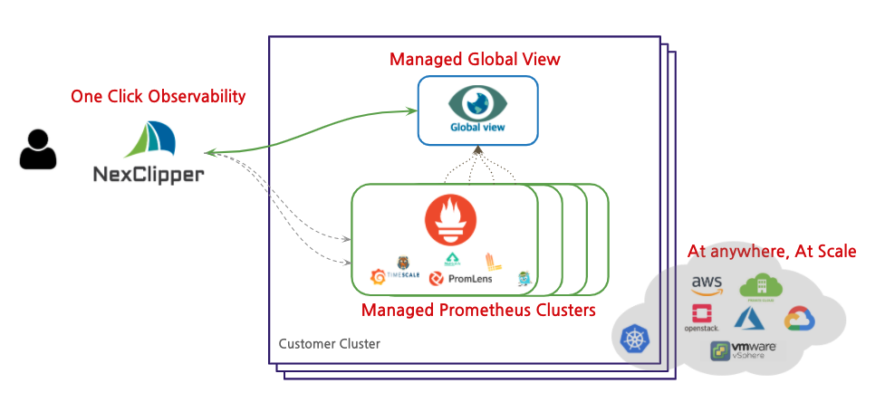

I had joined the NexClipper development team in April last year and have been developing NexClipper service since September. I'd like to talk about NexClipper, which is currently in progress to release version 0.5.  

<!--truncate-->

## What is Observability?

The term "Observability" comes from a control theory study first introduced in 1960 in the paper "On the General Theory of Control Systems" written by Rudolf E. Kálmán. Generally, observability refers to measuring whether the internal state of the system can be inferred from external signals and characteristics. To make it a little easier, it's a state where we can monitor the output of the system to make sure that the system we run operates reliably and to determine when it went wrong or why it went wrong when the problem occurred. When you apply it to IT, it means that you record and observe all the logs, events, and metrics that your cloud infrastructure and applications generate. 

## Cloud Native Observabilty and Limitation

Business in a cloud-native environment is built as a quick prototype with no delay in decision-making as new capabilities are added, and delivered to users through a variety of monitoring and metering capabilities. A/B testing, etc. will give you a very quick assessment of whether it is better or worse than the previous function. If the new version has better performance, you should keep the new deployment version intact, and if it gets worse, you should either remove the feature or restore it in a short time.

The move to a Kubernetes based cloud native application is evolving around a number of managed Kubernetes solutions, but needs to be ready for operations. Whether a commercial monitoring solution exists or not, the adoption of Prometheus open-source is essential for operations, but requires separate experts for deployment and operation (global views, authentication, long-term data storage, multi-tenancy, and so on) that are not supported in open source.

## Mission of NexClipper

### We want to solve the problems.

- Deploying and operating an open-source stack requires a lot of space and effort.
  - Prometheus, PromQL, Grafana dashboard, Configuration, Alert-Rule, etc.
- Long-term archiving of metric data is not easy.
  - By default, if each 3 Byte metric are stored 100,000 per second, you'll use about 500GB of storage every 30 days. Long-term archiving is not easy when operating Prometheus in the form of a local instance or a general pdd, and the more monitored you have, the more data you store.
- Data source duplication may occur.
  -  Prometheus is difficult to manage in terms of data sources when it is installed and operated in multiple clusters, and when you configure dashboards such as Grafana, it is difficult to distinguish between multiple clusters for the same metric. This makes it difficult to consolidate and view data when Prometheus is installed for each cluster.
- Complex configurations for scaling and high availability.
- There are some shortcomings in terms of group management and user authentication management (security).
- Prometheus cannot collect raw logs and events.
- Application-based request tracing is not supported itself.
- Anomaly Detection requires a separate data analysis capability.

### Managed Observability Platform At Anywhere.
Ensuring observability in any environment is a top priority, and making it easy to set up and use the Observability platform in your own cloud environment is a fundamental goal of NexClipper.

## Value of Nexclipper

### Make Observability Simple & Easy
NexClipper makes it easy and simple to deploy a complex and difficult Observability open-source stack within your private cluster. In the Kubernetes open-source ecosystem, all open sources requiring records, including logs and events, including Prometheus, the most widely used metric-based monitoring solution in the environment, are easy to provision and operate with expert-like experience.  

### Managed Prometheus (Eliminates Cloud Vendor Lock-in Problems)
Nexclipper are available on an open-source basis, making them highly scalable, and allowing users to eliminate the limitation of vendor lock-in. Support most existing public cloud environments, including AWS, based on the removal of dependencies. Not only is it Self-build Kubernetes, but it also supports managed Kubernetes from a variety of CSPs.

### Cost effective (Reduce human efforts and learning curve)
NexClipper automates repetitive tasks to avoid human error and reduces costs through reduced running curves. You can work with UI-based dashboards with everything you need, including repetitive dashboard configurations, AlertRule, and Managed Service Discovery settings, and use test features to reduce human error during the operation.

### Observe all of your data in single endpoint. (Global-View)
Manage on a per-cluster basis and store in a Global-View cluster at the same time, enabling data management for analysis. You can also monitor your existing deployed monitoring systems. If the individual cluster monitoring stack itself is in a failure situation, it can be monitored safely even if the notification is not delivered.

## Feature of NexClipper

NexClipper is developing on the following open-source base to add new convenience features while maintaining existing open-source solutions while leveraging the cloud native-based observability ecosystem, including Prometheus. Please refer to the homepage for detailed functions and descriptions.

#### [NexClipper](https://github.com/NexClipper/nexclipper)
 - Metrics Pipeline for interoperability and Enterprise Prometheus
####  [ExporterHub](https://github.com/NexClipper/exporterhub.io)
 - A Curated List of Prometheus Exporters for the Best practice
#### [Webstork](https://github.com/NexClipper/webstork)
 - Web tunnel for Cloud-native application remote monitoring
#### [Klevr](https://github.com/klevry/klevr)
 - Hyper-connected Cloud-native delivery solution for SaaS
#### [ProvBe](https://github.com/nexclipper/provbee)
 - Provisioning All the platforms for Cloud-native
#### [MetricArk](https://github.com/nexclipper/metricark)
- Prometheus based status(State/Event/Metric) Composite API

## Conclusion

NexClipper is "Managed Prometheus service for enterprise customers" that composed of open-sources and cloud native solution. NexClipper enables easy deployment of the Observability stack, including Prometheus that supports the many capabilities needed in enterprise environments. In the next posting, we will describe the features and benefits of NexClipper.

## Introduction of NexClipper

Nexcloud is a container-based cloud technology company. For full-scale global business, we are currently establishing a U.S. corporation, and we are bringing in competent people. For more information on the Job Description, please see the link below.

#### [We're Hiring](https://www.notion.so/nexclipper/We-re-Hiring-c356a7b503d5403289bc3cf8ac20c6ea)

Please give us various feedback on all of our technologies and products, including blogging, and if you have any questions or need any technical meetings, please contact us at [support@nexclipper.io](mailto:support@nexclipper.io) and we will reply to you as soon as soon as possible.

