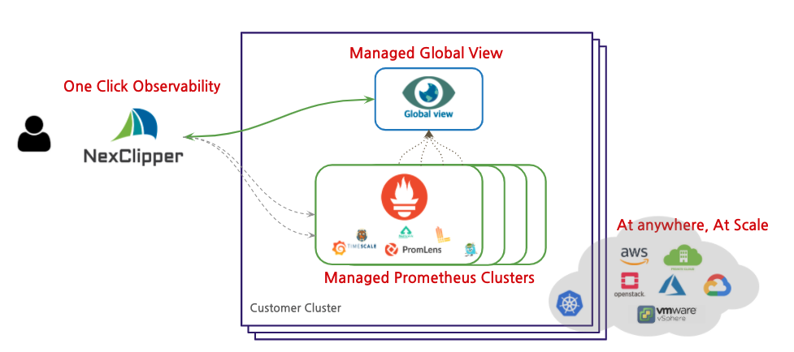

작년 4월에 합류해서 개발팀을 구성하고 9월부터 본격적으로 NexClipper 서비스 개발을 진행하고 있습니다. 현재 0.5 버전 릴리스까지 진행해온 NexClipper에 대해 이야기 하고자 합니다. 

<!--truncate-->

## 관찰 가능성(Observabilty)이란?

관찰 가능성(Observabilty)이라는 용어는 1960년 루돌프 칼만(Rudolf E. Kálmán)이 저술한 "On the General Theory of Control Systems"이라는 논문에 처음 소개된 제어 이론 연구에서 유래되었습니다. 일반적으로 관찰 가능성은 `시스템의 내부 상태를 외부 시그널과 특성으로 추론할 수 있는지 측정하는 것`을 말합니다. 조금 더 쉽게 이야기 하면, 우리가 운영하는 시스템이 안정적으로 동작하는지 확인하고 문제가 발생했을때 언제 잘못되었는지 어떤 이유인지 파악하기 위해 시스템의 출력을 잘 관찰할 수 있는 상태를 말합니다. 이를 IT에 적용하면 클라우드 인프라와 어플리케이션에서 생성하는 로그와 이벤트, 메트릭 등 모든것을 기록하고 관찰하는 것을 의미합니다. 좀 더 자세한 내용은 [이전 글(Infrastructure Monitoring)](2020-06-08-infrastructure-monitoring.md)을 참고하시기 바랍니다.

## Cloud Native Observabilty 과 한계

클라우드 네이티브 환경에서의 비즈니스는 새로운 기능을 추가할 때 의사결정의 지연없이 빠른 프로토타입으로 제작되고, 다양한 모니터링 및 계측 기능을 통해 사용자에게 전달됩니다. A/B 테스트 등을 통해 이전 기능보다 더 나은지 또는 더 나쁜지에 대해 아주 빠른 시간안에 평가를 하게 됩니다. 새 버전의 성능이 더 좋으면 새로운 배포 버전을 그대로 유지하고, 더 나빠지면 기능을 빼거나 원복을 빠른 시간안에 진행해야 합니다.  

또한 쿠버네티스 기반 클라우드 네이티브로 전환하기 위해 많은 매니지드 쿠버네티스 솔루션를 중심으로 발전 중이나 구축 후 운영에 대한 준비가 필요합니다. 상용 모니터링 솔루션의 유무에 상관없이 쿠버네티스 기반 운영에는 프로메테우스 오픈소스 도입이 필수 불가결적이지만 엔터프라이즈 환경에서 지원하지 않는 기능(글로벌 뷰, 인증, 장기데이타 저장, 멀티테넌시등)과 구축 및 운영을 위한 전문가가 별도로 필요하며 기존 솔루션들이 적합하지 않은 문제를 가지고 있습니다.

## NexClipper의 목표

### 이런 문제를 해결하고자 합니다.

- 오픈소스 스택을 배포하고 운영하는데는 많은 공수와 노력이 필요합니다. 
  - Prometheus, PromQL 학습, Grafana 대시보드 구성, Alert-Rule 작성 등
- 메트릭 데이터 장기 보관이 쉽지 않습니다.
  - 기본적으로 3Byte 사이즈의 메트릭이 초당 100,000 개씩 저장될 경우 30일에 500GB 정도 스토리지를 사용하게 됩니다. 로컬 인스턴스나 파드 형태로 프로메테우스를 운영할 경우 장기 보관이 쉽지 않으며 모니터링 대상이 많아질수록 더 많은 데이터를 저장하게 됩니다.
- 데이터 소스 중복이 발생할 수 있습니다.
  - 프로메테우스는 여러 클러스터에 설치해서 운영할 경우 데이터 소스 측면에서 관리가 쉽지 않으며,  Grafana와 같은 대시보드를 구성할 경우 동일한 메트릭에 대해서 여러 클러스터에 쿼리를 수행할 경우 구분하기가 쉽지 않습니다. 이로 인해 각 클러스터 별로 프로메테우스가 설치될 경우 데이터를 통합해서 보기가 어렵습니다.
- 스케일링(horizontal scaling) 및 고가용성에 대한 구성이 복잡합니다.
- 그룹관리 및 사용자 인증 관리(보안) 측면에서 부족한 부분이 있습니다.
- 프로메테우스는 원시 로그 / 이벤트 수집이 불가합니다.
- 애플리케이션 기반 요청 추적(Request Tracing)이 자체적으로 지원이 되지 않습니다.
- 이상 감지(Anomaly Detection)를 하기 위해서는 별도의 데이터 분석 역량이 필요합니다.

### Managed Observability Platform At Anywhere.
어떤 환경에서도 관측 가능성을 확보시켜주는 것을 최우선으로 생각하고, 직접 운영하는 클라우드 환경에서 Observability 플랫폼을 쉽게 설정하고 사용할 수 있도록 하는것이 NexClipper의 기본적인으로 추구하는 목표입니다. 

## NexClipper의 가치

### Make Observability Simple & Easy
NexClipper는 복잡하고 어려운 Observability 오픈소스 스택을 쉽고 간단하게 고객의 클러스터 내에 구축이 가능합니다. 쿠버네티스 오픈소스 생태계에서 환경에서 가장 널리 사용하는 메트릭(Metric) 기반 모니터링 솔루션인 프로메테우스(Prometheus)를 포함하여 기업에서 필요로하는 로그, 이벤트 등 기록이 필요한 모든 오픈소스를 쉽고 전문가의 도움과 유사한 경험으로 빠르고 쉽게 프로비저닝하고 운영하는 환경을 제공합니다.  

### Managed Prometheus
오픈소스 생태계 기반으로 제공되어 확장성이 뛰어나고, 사용자는 벤더 락인이라는 제한사항을 제거할 수 있습니다. 종속성 제거를 바탕으로 AWS를 포함한 대부분의 존재하는 퍼블릭 Cloud 환경을 지원합니다. 구축형 Kubernetes 뿐 아니라 다양한 CSP에서 제공하는 Managed Kubernetes 를 지원합니다.

### Cost effective
NexClipper는 반복적 작업을 자동화하여 휴먼 에러를 방지할 수 있고, 러닝 커브 감소를 통해 비용 절감이 가능합니다. 반복적인 대시보드 구성 및 AlertRule, 관리되는 Service Discovery 설정 등 운영에 필요한 모든 작업을 UI기반 대시보드에서 작업이 가능하고, 테스트 기능을 활용하여 작업 중 발생할 수 있는 휴먼 에러를 감소시킬 수 있습니다.  

### Observe all of your data in single endpoint
개별 클러스터 별로 관리하면서 동시에 Global-View 클러스터에 저장함으로써, 분석을 위한 데이터 관리가 가능해집니다. 또한, 기존 구축된 모니터링 시스템을 모니터링할 수 있습니다. 개별 클러스트 모니터링 스택 자체가 장애 상황일 경우 알림이 전달되지 못하는 경우에도 안전하게 모니터링이 가능합니다.  

## NexClipper의 구성요소

NexClipper는 이런 부분을 프로메테우스를 포함한 클라우드 네이티브기반 관찰 가능성 에코시스템을 그대로 활용하면서 기존의 오픈소스 솔루션을 유지하면서도 새로운 편의 기능들을 추가하기 위해 아래와 같은 기능들을 기반으로 개발중입니다. 자세한 설명은 [홈페이지](https//nexclipper.io)를 참고하시기 바랍니다.  

#### [NexClipper](https://github.com/NexClipper/nexclipper)
 - Metrics Pipeline for interoperability and Enterprise Prometheus
####  [ExporterHub](https://github.com/NexClipper/exporterhub.io)
 - A Curated List of Prometheus Exporters for the Best practice
#### [Webstork](https://github.com/NexClipper/webstork)
 - Web tunnel for Cloud-native application remote monitoring
#### [Klevr](https://github.com/klevry/klevr)
 - Hyper-connected Cloud-native delivery solution for SaaS
#### [ProvBe](https://github.com/nexclipper/provbee)
 - Provisioning All the platforms for Cloud-native
#### [MetricArk](https://github.com/nexclipper/metricark)
- Prometheus based status(State/Event/Metric) Composite API

## 정리

NexClipper는 오픈소스 기반의 클라우드 네이티브 솔루션으로 프로메테우스를 포함한 Observability 스택의 쉬운 구축 운영과 엔터프라이즈 환경에서의 필요한 다양한 기능을 지원하는 “기업 고객을 위한 관리형 프로메테우스 서비스”입니다. 다음 포스팅에서는 NexClipper가 제공하는 기능과 특장점에 대해 설명할 예정입니다.  

## 시작하기

넥스클리퍼를 빠르고 쉽게 시작해보세요.  

## 넥스클라우드 소개

넥스클라우드는 컨테이너 기반 클라우드 기술 회사입니다. 본격적인 글로벌 사업을 위해 현재 미국 법인 설립을 진행 중이며 능력있는 분들을 모시고 있습니다. 자세한 Job Description은 아래 링크를 확인하시기 바랍니다.  

#### [We're Hiring](https://www.notion.so/nexclipper/We-re-Hiring-c356a7b503d5403289bc3cf8ac20c6ea)

블로그 내용을 포함한 저희의 모든 기술과 제품에 대한 다양한 피드백 부탁드리고, 언제든지 궁금한 사항이 있으시거나 기술 미팅 등 필요한 사항이 있으시면 언제든지 [support@nexclipper.io](mailto:support@nexclipper.io) 로 연락 주시면 빠른 시간 내에 회신 드리도록 하겠습니다.

