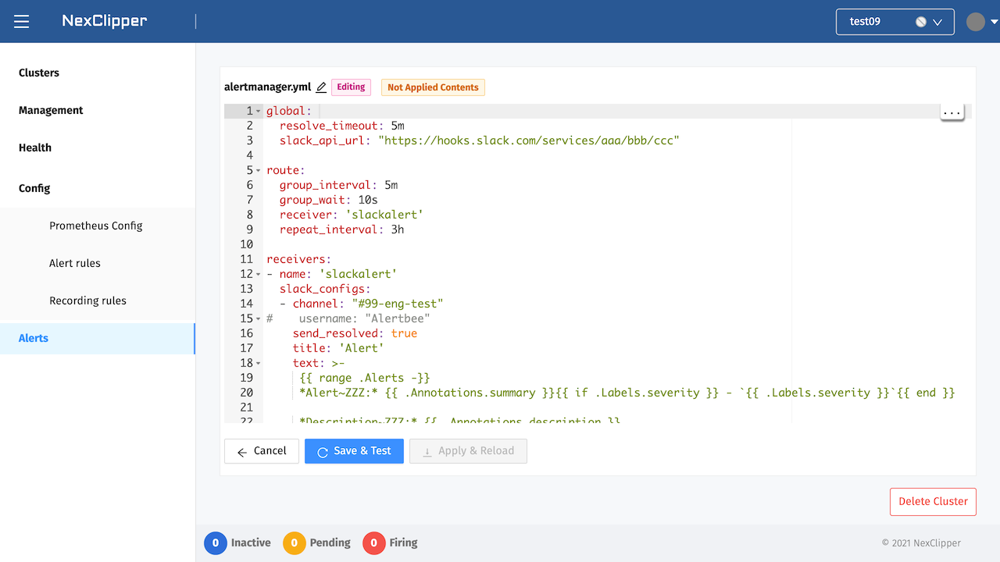

## Edit & Unit Test for Alertmanager Config

Click on `Alerts` under Alertmanager to modify the configuration in the currently provisioned state. It allows you to edit configuration on the editor screen. And you can use the `amtool test` to determine whether there is a problem with the unit test. If there is no problem, just save and apply it. 

The functions that edit and test Alertmanager Configurations are operated through `Edit`, `Save & Test`. This step checks for YAML syntax errors in the config and rules.

After the test passed, the configuration will be temporarily stored, but it doesn't mean actually applied to the Alertmanager cluster. 

Let's take a look at cases where the test failed. For example, `global.scrape_timeout`, you should enter a value within 60 seconds. Otherwise,it is considered abnormal and the test fails. In the case of failure, the related log is printed on the page.

  

If there is no problem with the Configuration, apply it through `Apply & Reload` and restart the Alertmanager instance.

The Alertmanager Configuration can also be modified, tested, and applied.

