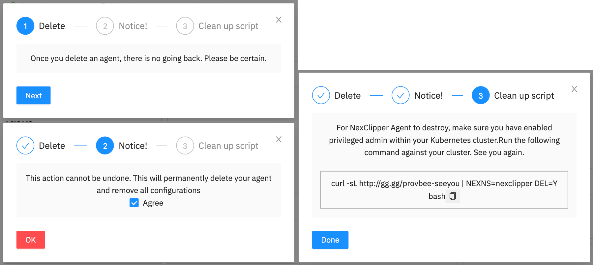

## Delete Cluster

NexClipper will no longer be available after the cluster is deleted. 
Cluster must be installed if you'd like to use again.  

If you want to delete Nexclipper cluster, click on `Delete Cluster` on the bottom right.


After several steps including consent, you can delete a cluster.



To delete NexClipper Suite completely, run the following script.

```sh
curl -sL http://install.p8s.me/provbee-seeyou | NEXNS=nexclipper DEL=Y bash
```
