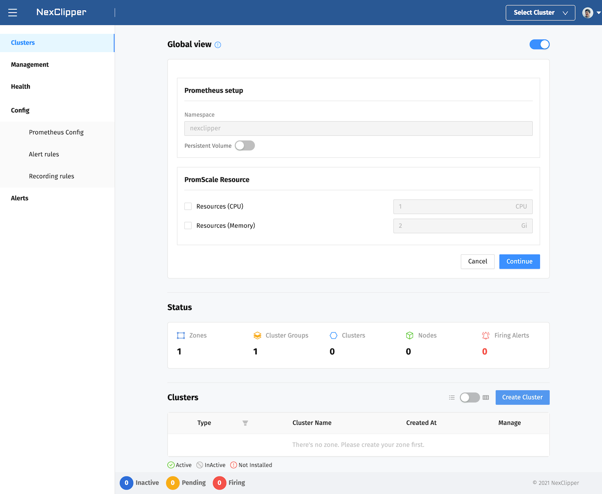
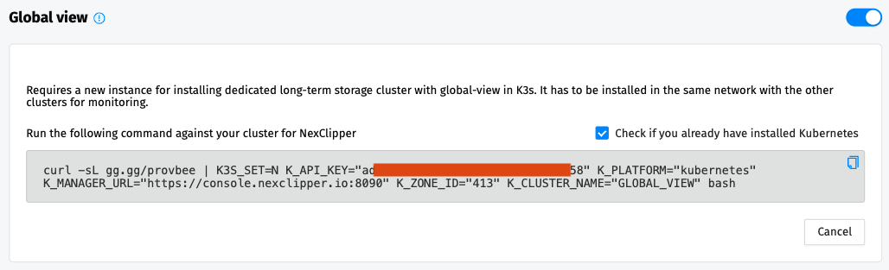
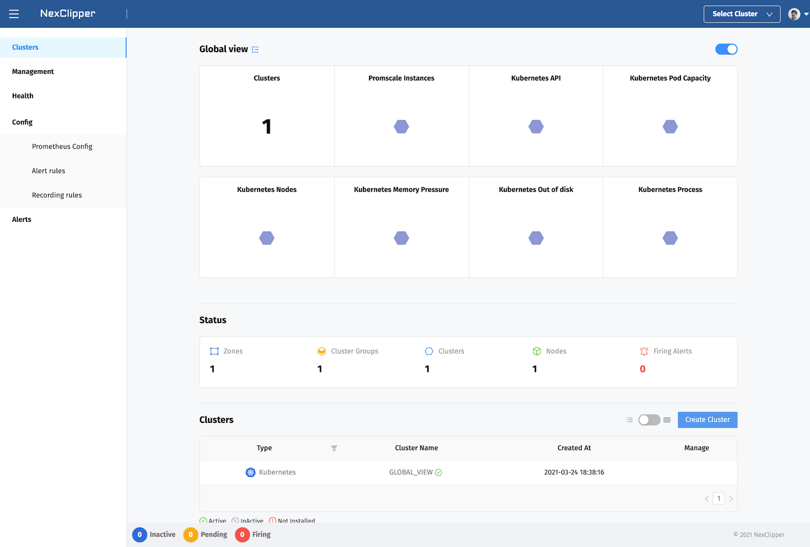

## Global View

Requires a new instance or preconfigured kubernetes cluster for installing dedicated long-term storage cluster with global-view. It has to be
installed in the same network with the other clusters for monitoring.

## Minimum Requirements (Kubernetes)

* Target Kubernetes Cluster : 1.15.12 or higher
* Cluster Hardware
  * RAM: 4GB Minimum (Recommended 6GB)
  * CPU: 2Core Minimum
  * Volume: 40Gi
* Bastion Host : Linux(WSL included), MacOS 10.14+
* Bastion Software
  * bash or zsh
  * curl
  * ssh-keygen
* Firewall
  * Client(WebService) -> Outbound (Destination : console.nexclipper.io, Port: 80,443,8080)
  * NexClipper Agent(DaemonSet) -> Outbount (Destination : console.nexclipper.io, Port: 8090)

## Minimum Requirements (Instance)

* Operating Systems : Modern Linux systems(WSL, Alpine, Raspbian Buster included)
* Software
  * bash or zsh
  * curl
  * ssh-keygen
* Hardware
  * RAM: 4GB Minimum (Recommended 6GB)
  * CPU: 2Core Minimum
  * Disk: 40Gi
* Firewall
  * Client(WebService) -> Outbound (Destination : console.nexclipper.io, Port: 80,443,8080)
  * NexClipper Agent(DaemonSet) -> Outbount (Destination : console.nexclipper.io, Port: 8090)
---

## Installation

If you want to setup global-view cluster, toggle the button on Global view. It allows you to edit resources of global view cluster. And you can also customize volume size of global view cluster.  



Next, select a checkbox whether kubernetes environment or not. And click `Continue` button will be created bootstrap script to install global cluster.



Run the generated script from zsh, bash-enabled Bastion, or Local. And you are expected to get results similar to the following.

```sh
$ curl -sL gg.gg/provbee | K3S_SET=N K_API_KEY="<API_KEY_GENERATED>" K_PLATFORM="kubernetes" K_MANAGER_URL="https://console.nexclipper.io:8090" K_ZONE_ID="413" K_CLUSTER_NAME="GLOBAL_VIEW" bash
NexClipper serivce first checking
[INFO]   Welcome to NexClipper!
namespace/nex-system created
serviceaccount/nexc created
secret/nexc-ssh-key created
secret/nex-secrets created
configmap/nex-system-agent-config created
role.rbac.authorization.k8s.io/nexclipper-role created
clusterrolebinding.rbac.authorization.k8s.io/nexc-rbac created
rolebinding.rbac.authorization.k8s.io/nexclipper-rb created
Cluster "kind-kind" set.
User "nexc-nex-system-kind-kind" set.
Context "nexc-nex-system-kind-kind" modified.
Switched to context "nexc-nex-system-kind-kind".
secret/nexc-kubeconfig created
service/provbee-service created
deployment.apps/provbee created
daemonset.apps/klevr-agent created
:+:+:+:+:+:+:+:+:+:+:+:+:+:+:+:+:+:+:+:+:+:
## Namespace "nex-system" check	  OK.
```

After NexClipper components are installed, you will be able to communicate with NexClipper Manager server. As you can see it on the following page, you are expected to get results similar to the following.

