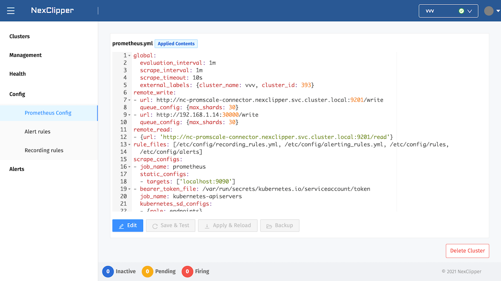

## Getting Started with NexClipper Cloud

### Overview

The NexClipper component consists of three main types of resources.  
The NexClipper Services runs in DaemonSet, StatefulSet, and Deployment within the Kubernetes cluster.  
All resources run nex-system, nexclipper Namespace by default, and contain ecosystems related to Prometheus.

|Component|Resource|Role|
|---|---|---|
|Klevr Agent|DaemonSet|Communicate with NexClipper Manager|
|Provbee|Deployment|Provisioning and Task Processing|
|Prometheus|Deployment|Metric-Based Monitoring Tool|
|node-exporter|DaemonSet|Machine Metric Collection Exporter|
|Grafana|Deployment|Visualization Dashboard Tool|
|Kube-state-metrics|Deployment|Cluster Metric Collection Tool|
|Alertmanager|Deployment|Alarm Management Tools|
|pushgateway|Deployment|Small Batchjob Metric Collection Tool|
|Promlens|Deployment|Query Builder based on PromQL|
|Promscale|Deployment|Prometheus Metric Analysis Tool|
|TimescaleDB|StatefulSet|Time Series-Based SQL DB|
|MetricOperator|Deployment|Caching Cluster State|
|NexCloud Basic|Deployment|Basic Dashboard|
|ExporterHub(Preparing)|Deployment|Exporter curation page|

:::note
The NexCliper Agent has been tested for Kubernetes version 1.15.12 or higher. Problems may occur in lower versions.
:::

---

### Minimum Requirements

NexClipper is intended to run in a Linux environment by default.

* Operating Systems : Linux(Included WSL), MacOS 10.14+
* Software
  * bash or zsh
  * curl
  * ssh-keygen
* Target Kubernetes Cluster : 1.15.12 or higher
* Firewall
  * Client(WebService) -> Outbound (Destination : console.nexclipper.io, Port: 80,443,8080
  * NexClipper Agent(DaemonSet) -> Outbount (Destination : console.nexclipper.io, Port: 8090)
---

### Installation

There are two options for installation.  

1. Remote Kubernetes
   * An environment that can communicate remotely to kube-apiserve (kubeconfig environment)
2. Local Kubernetes
   * When running locally, such as Docker Desktop, Minikube, K3s, MicroK8s, etc.


Run the following command to determine the currently connected cluster in an environment that can run bash or zsh. If you configured your Kubernetes environment with docker-desktop, you might get results similar to the following:

```bash
$ kubectl cluster-info
Kubernetes master is running at https://kubernetes.docker.internal:6443
KubeDNS is running at https://kubernetes.docker.internal:6443/api/v1/namespaces/kube-system/services/kube-dns:dns/proxy
```

:::caution
You might encounter problems if you install duplicates with an existing operating Prometheus Operator. NexClipper distributes and manages Prometheus-related ecosystems based on Helm.
:::

---

### Kubernetes

Go to [https://nexclipper.github.io/](https://nexclipper.github.io/) and click the `Login` menu.


Go to [https://console.nexclipper.io/login](https://console.nexclipper.io/login) Page.


:::info
Currently, we only support e-mail and Google Authentication (including GSuite). If you need to use it, please contact support@nexclipper.io.
:::

Log in with your Account.

For first-time users, you can check the Welcome screen as shown below.


NexClipper is similar to a Kubernetes cluster, but with a different concept, it works based on a logical group called a Cluster where a separate NexClipper Product is installed. Follow these steps for issuing API KEY mapped to your account.

Type a Cluster Name. The Cluster Name is the value shown in the list and is the input value for the user to distinguish the cluster.


Select the target platform or infrastructure to provision.

:::info
Currently, only Kubernetes clusters are supported. We will also provide a Baremetal, Instance, or Laptop environment and a Public Cloud environment.
:::


Bootstrap scripts will be created to install on the selected platform.


Run the generated script from zsh, bash-enabled Bastion, or Local.

For Kubernetes environments, run the script below.
```sh
curl -sL gg.gg/provbee | TAGKLEVR=0.2.4-SNAPSHOT K3S_SET=N K_API_KEY="977b9d295d0f4273be3575cdaeae22b3" K_PLATFORM="kubernetes" K_MANAGER_URL="http://console.nexclipper.io:8090" K_ZONE_ID="62" bash
```

If it is not a Kubernetes environment such as local and laptop, run the script below. The script will be installed based on K3s.
```sh
curl -sL gg.gg/provbee | TAGKLEVR=0.2.4-SNAPSHOT K3S_SET=Y K_API_KEY="977b9d295d0f4273be3575cdaeae22b3" K_PLATFORM="kubernetes" K_MANAGER_URL="http://console.nexclipper.io:8090" K_ZONE_ID="62" bash
```

```sh
NexClipper serivce first checking
[INFO]   Welcome to NexClipper!
namespace/nex-system created
serviceaccount/nexc created
secret/nexc-ssh-key created
secret/nex-secrets created
configmap/nex-system-agent-config created
role.rbac.authorization.k8s.io/nexclipper-role created
clusterrolebinding.rbac.authorization.k8s.io/nexc-rbac created
rolebinding.rbac.authorization.k8s.io/nexclipper-rb created
Cluster "docker-desktop" set.
User "nexc-nex-system-docker-desktop" set.
Context "nexc-nex-system-docker-desktop" modified.
Switched to context "nexc-nex-system-docker-desktop".
secret/nexc-kubeconfig created
service/provbee-service created
deployment.apps/provbee created
daemonset.apps/klevr-agent created
:+:+:+:+:+:+:+:+:+:+:+:+:+:+:+:+:+:+:+:+:+:
## Namespace "nex-system" check	  OK.
## NexClipper system check	  OK. 🍯❤️🐝
 ⛵ Enjoy NexClipper! :)
:+:+:+:+:+:+:+:+:+:+:+:+:+:+:+:+:+:+:+:+:+:
88888888ba                                         88888888ba
88      '8b                                        88      '8b
88      ,8P                                        88      ,8P
88aaaaaa8P'  🐝,dPPYba,   ,adPPYba,   8b       d8  88aaaaaa8P'   ,adPPYba,   ,adPPYba,
88'''''''    88P'   'Y8  a8'     '8a  '8b     d8'  88''''''8b,  a8P_____88  a8P_____88
88           88          8b       d8   '8b   d8'   88      '8b  8PP'''''''  8PP'''''''
88           88          '8a,   ,a8'    '8b,d8'    88      a8P  '8b,   ,aa  '8b,   ,aa
88           88           ''YbbdP''       '8'      88888888P'    ''Ybbd8''   ''Ybbd8''
```

Click `Continue` and go to the next step.

You will not be able to communicate with the NexClipper Manager server until Klevr and Provbee installation is complete, so you can see the following screens. If the installation script is not running, you can see it on the following screen. 


You can also check the agent installation status through kubectl.

The nex-system namespace creates Klevr agent (DaemonSet), Provbee (Deployment).

```sh
> kubectl get pod -n nex-system
NAME                         READY   STATUS    RESTARTS   AGE
klevr-agent-8dh6g            1/1     Running   0          11m
provbee-67f8ffbf55-2tpfs     1/1     Running   0          11m
```

When the agent installation is complete, the agent status changes to Running as shown below. Then, The feature is enabled to install the Prometheus stack.


The default installation options are as follows.  


* Namespace : Kubernetes namespace where the stack will be installed
(Default: nexclipper)
* Volume Size(GB): TimescaleDB Volume Size(Default: 10Gi)
* Replicas: TimescaleDB Cluster Replicas (Default: 1)
* Storage Class Name: Storage classes to use when using separate PVs
 (Default: LocalVolume)
* Size of Wal(GB): Prometheus WAL Volume Size(Default: 2Gi)
* Grafana Admin Password : Grafana initial password(Default: admin)

By default, at the `nexclipper` namespace will have the following Prometheus ecosystems.  

* prometheus
* node-exporter
* kube-state-metrics
* alertmanager
* grafana
* promscale
* promlens
* timescaledb

```sh
> kubectl get deploy,statefulset -n nexclipper
NAME                                         READY   UP-TO-DATE   AVAILABLE   AGE
deployment.apps/nc-grafana                   1/1     1            1           8m39s
deployment.apps/nc-kube-state-metrics        1/1     1            1           8m39s
deployment.apps/nc-prometheus-alertmanager   1/1     1            1           8m39s
deployment.apps/nc-prometheus-pushgateway    1/1     1            1           8m39s
deployment.apps/nc-prometheus-server         1/1     1            1           8m39s
deployment.apps/nc-promlens                  1/1     1            1           8m39s
deployment.apps/nc-promscale                 1/1     1            1           8m39s

NAME                              READY   AGE
statefulset.apps/nc-timescaledb   1/1     8m39s
```

Additionally, The nex-system namespace creates WebStork (Deployment), and MetricOps (Deployment).

```sh
> kubectl get deploy,daemonset -n nex-system
NAME                        READY   UP-TO-DATE   AVAILABLE   AGE
deployment.apps/metricops   1/1     1            1           10m
deployment.apps/provbee     1/1     1            1           18m
deployment.apps/webstork    1/1     1            1           10m

NAME                         DESIRED   CURRENT   READY   UP-TO-DATE   AVAILABLE   NODE SELECTOR   AGE
daemonset.apps/klevr-agent   1         1         1       1            1           <none>          18m
```

You can return to the console to view the list of provisioned clusters.


You can view the details of the cluster.

* Platform
  * It shows the current platform type, agent and prometheus stack status.
* Cluster Detail
  * It shows the number of nodes that currently have agents deployed and the version information Kubernetes Account information installed.
* Tasks
  * It shows all Job and Task status performed by NexClipper.
* Prometheus
  * It shows the currently installed Prometheus stack. Also, it has the feature to expose externally accessible endpoints in the Prometheus ecosystem. Click on the ecosystem to view more detailed information, and you can see the each dashboard exposed on NodePort or LoadBalancer.
* Volumes
  * It shows the current PVs information and status for long-term storage.

Clicking the link or Health menu of Prometheus will take you to the Prometheus Health dashboard.


By default, you can view the information in the cluster as follows.  
* Age(Cluster Age): Time elapsed since cluster creation
* Cluster Status: Status of cluster nodes
  * All nodes are healthy - All Ready
  * Some nodes are healthy - Partially Ready
  * All nodes unhealthy - Not Ready
* Nodes: Number of Nodes
* Unavaliable Node: Unhealthy Node Count
* Namespaces: Number of Namespaces
* Cluster Pod Usage: Pod Utilization in Cluster
* Cluster CPU Usage: CPU Utilization in Cluster
* Cluster Memory Usage: Memory Utilization in Cluster
* Cluster Disk Usage: Disk Utilization in Cluster
* Pods: Number of active Pods
* Restarted Pods(30m): Number of Pods restarted in 30 minutes
* Failed Pods: Number of Pods in Failed state
* Pending Pods: Number of Pods in the Pending state
* PVCs: Number of PersistentVolumeClaims
* Prometheus Status: Prometheus Instance Status
* Alertmanager Status: Alertmanager Instance Status
* API Server Status: Cluster API Server Status
* API server total requests code: 5 minute average by Kubenetes API response code

Click the Config menu under Prometheus to modify the configuration in the currently provisioned state. Basically the feature is possible to edit config and rules(alert, recording) on the editor screen, and you can use the promtool test function to determine whether there is a problem with the unit test, and save and apply it if there is no problem.



The functions that edit and test Prometheus Configurations are operated through `Edit`, `Save & Test`. This step checks for YAML syntax errors in the config and rules.

When the test is successfully completed, the configuration will be temporarily stored if the test is passed as shown below, and it is not actually applied to the Prometheus cluster.


Let's take a look at cases where the test fails. For example, `global.scrape_timeout`, if you enter a value in above 60 seconds, it is considered abnormal and the test fails. In the case of failure, the related log is printed on the screen and shown.

  

If there is no problem with the Configuration, apply it through `Apply & Reload` and restart the Prometheus instance.


The Alert Configuration, Alert-Rule, and Recording-Rule can also be modified, tested, and applied in the same way as above.


