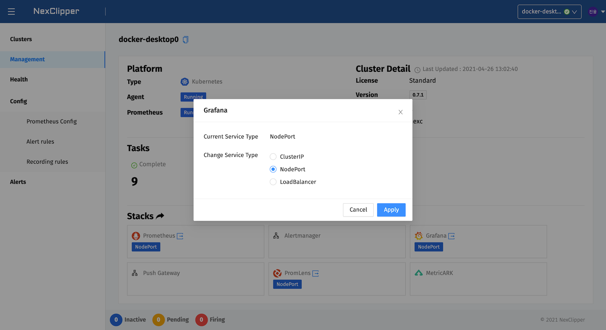
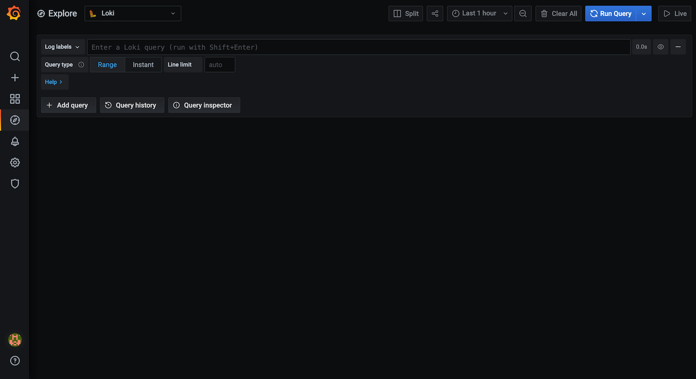

## Logging with NexClipper

### Loki on Grafana Dashboard

Connect to NexClipper Console and go to 'Management'.

Click Grafana on Stacks and select the service type you want to expose. If you are on the same network or Local, select NodePort. Or if you need an external environment, select LoadBalancer.

:::info
LoadBalancer feature is only available for cloud providers or environments in which support external load balancers.  
[Kubernetes Load Balancer](https://kubernetes.io/docs/tasks/access-application-cluster/create-external-load-balancer/)
:::




By default, ID and password is set as `admin`:`admin` if there is no password input during initial setup.

After signing in Grafana, select `Explorer` tab of Left Menu or connect to `http://<grafana-endpoint>:<port>/explorer` to view the following page:



### LogQL

LogQL is a Log Query Language and has a separate query scheme.  
By default, you can filter logs as you make 'grep' command in Linux.

LogQL consists of Log Stream Selector and Filter Expression.

### Log Stream Selector

Log Stream Selector selects the log stream that should be included in the query as shown below. It consists of one or more key-values, such as the following query expression.

```json
{container="kube-apiserver"}
```

You can set key and value query expression yourself as above or select menu 'Log Labels' > 'container' > 'kube-apiserver'.

A operator is also available for labels. It's same as the Prometheus label query method.

> [https://prometheus.io/docs/prometheus/latest/querying/basics/#instant-vector-selectors](https://prometheus.io/docs/prometheus/latest/querying/basics/#instant-vector-selectors)

The following queries can also be queried:

- When querying logs that except 'kube-apiserver'
  ```json
  {container!="kube-apiserver"}
  ```

- When querying logs that include 'kube'
  ```json
  {container=~"kube.*"}
  ```

- When querying logs that do not include 'kube'
  ```json
  {container!~"kube.*"}
  ```


### Filter Expression

After querying log stream selector, the result of logs can be filtered with a search expression. The search expression can be just text or regex:

- Container 'kube-apiserver' shows results that contain 'error' but not 'timeout'.
  ```json
  {container="kube-apiserver"} |= "error" != "timeout"
  ```

- To determine the rate of a log at 1-minute intervals:
  ```json
  rate({container="kube-apiserver"}[1m] |= "error" != "timeout")
  ```

- To identify logs starting with 'kube' at 1-minute intervals, group them with 'container' and show the top 10 in order.
- 
  ```json
  topk(10,sum(rate({container=~"kube.*"}[1m] |= "error" != "timeout")) by (container))
  ```

This was a simple example of setting up and working with Loki and Grafana. If you want to learn more, head over to the [Loki documentation](https://grafana.com/docs/loki/latest/).
