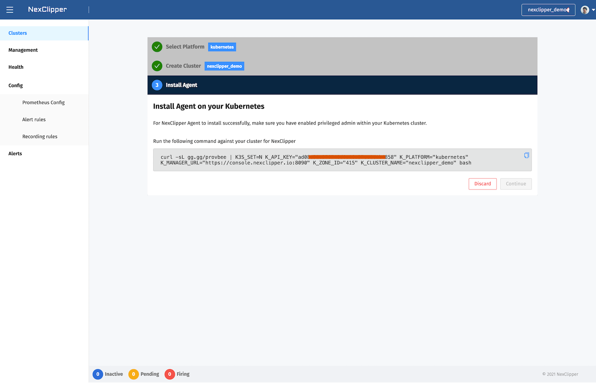

# NexClipper Quick Start

NexClipper runs in the type of DaemonSet, StatefulSet, and Deployment within your own Kubernetes cluster.  
All resources run in the nex-system, nexclipper Namespace by default, and contain ecosystem related to Prometheus.

---

## Check Environment

NexClipper runs in a Linux environment.

* Operating Systems : Linux(WSL included), MacOS 10.14+
* Software
  * bash or zsh
  * curl
  * ssh-keygen
* Target Kubernetes Cluster : 1.15.12 or higher
* Firewall
  * Client(WebService) -> Outbound (Destination : console.nexclipper.io, Port: 80,443,8080)
  * NexClipper Agent(DaemonSet) -> Outbount (Destination : console.nexclipper.io, Port: 8090)

:::info
NexClipper Agent has been tested for Kubernetes version 1.15.12 or higher. Problems may occur in lower versions.
:::

Run the following command to check the currently connected cluster in an environment that can run bash or zsh. If you have configured your Kubernetes environment with docker-desktop, you are expected to get results similar to the following:

```bash
$ kubectl cluster-info
Kubernetes master is running at https://kubernetes.docker.internal:6443
KubeDNS is running at https://kubernetes.docker.internal:6443/api/v1/namespaces/kube-system/services/kube-dns:dns/proxy
```
---

## Install NexClipper

There are two options for installation.  

1. Remote Kubernetes
   * An environment that can communicate remotely to kube-apiserve (kubeconfig environment)
2. Local Kubernetes
   * When running locally, such as Docker Desktop, Minikube, K3s, MicroK8s, etc.

:::caution
You might encounter problems if you install duplicates with an existing operating Prometheus Operator. NexClipper distributes and manages Prometheus-related ecosystem based on Helm.
:::

Go to [https://console.nexclipper.io/login](https://console.nexclipper.io/login) Page. And login with your Account.


:::info
Currently, we only support e-mail and Google Authentication (including GSuite). If you need to use NexClipper, please contact support@nexclipper.io.
:::

Now, Create Cluster and enter the unique cluster name you want. At QuickStart, you should select Kubernetes platform to provision.  

And bootstrap script will be created to install on the selected platform.



Run the generated script from zsh, bash-enabled Bastion, or Local. And you are expected to get results similar to the following.  

```sh
$ curl -sL gg.gg/provbee | TAGKLEVR=0.2.4-SNAPSHOT K3S_SET=N K_API_KEY="977b9d295d0f4273be3575cdaeae22b3" K_PLATFORM="kubernetes" K_MANAGER_URL="http://console.nexclipper.io:8090" K_ZONE_ID="62" bash
NexClipper serivce first checking
[INFO]   Welcome to NexClipper!
namespace/nex-system created
serviceaccount/nexc created
secret/nexc-ssh-key created
secret/nex-secrets created
configmap/nex-system-agent-config created
role.rbac.authorization.k8s.io/nexclipper-role created
clusterrolebinding.rbac.authorization.k8s.io/nexc-rbac created
rolebinding.rbac.authorization.k8s.io/nexclipper-rb created
Cluster "docker-desktop" set.
User "nexc-nex-system-docker-desktop" set.
Context "nexc-nex-system-docker-desktop" modified.
Switched to context "nexc-nex-system-docker-desktop".
secret/nexc-kubeconfig created
service/provbee-service created
deployment.apps/provbee created
daemonset.apps/klevr-agent created
:+:+:+:+:+:+:+:+:+:+:+:+:+:+:+:+:+:+:+:+:+:
## Namespace "nex-system" check	  OK.
## NexClipper system check	  OK. 🍯❤️🐝
 ⛵ Enjoy NexClipper! :)
:+:+:+:+:+:+:+:+:+:+:+:+:+:+:+:+:+:+:+:+:+:
88888888ba                                         88888888ba
88      '8b                                        88      '8b
88      ,8P                                        88      ,8P
88aaaaaa8P'  🐝,dPPYba,   ,adPPYba,   8b       d8  88aaaaaa8P'   ,adPPYba,   ,adPPYba,
88'''''''    88P'   'Y8  a8'     '8a  '8b     d8'  88''''''8b,  a8P_____88  a8P_____88
88           88          8b       d8   '8b   d8'   88      '8b  8PP'''''''  8PP'''''''
88           88          '8a,   ,a8'    '8b,d8'    88      a8P  '8b,   ,aa  '8b,   ,aa
88           88           ''YbbdP''       '8'      88888888P'    ''Ybbd8''   ''Ybbd8''
```

---

After NexClipper components are installed, you will be able to communicate with NexClipper Manager server. As you can see it on the following page, you are expected to get results similar to the following.  


Now, you can return to the console to view the list of provisioned clusters.


## Simple Health Dashboard

Clicking the link or Health menu will take you to the Prometheus & Kubernetes Health dashboard.


You can view the information in the cluster.  
* Age(Cluster Age): Time elapsed since cluster creation
* Cluster Status: Status of cluster nodes
  * All nodes are healthy - All Ready
  * Some nodes are healthy - Partially Ready
  * All nodes unhealthy - Not Ready
* Nodes: Number of Nodes
* Unavaliable Node: Unhealthy Node Count
* Namespaces: Number of Namespaces
* Cluster Pod Usage: Pod Utilization in Cluster
* Cluster CPU Usage: CPU Utilization in Cluster
* Cluster Memory Usage: Memory Utilization in Cluster
* Cluster Disk Usage: Disk Utilization in Cluster
* Pods: Number of active Pods
* Restarted Pods(30m): Number of Pods restarted in 30 minutes
* Failed Pods: Number of Pods in Failed state
* Pending Pods: Number of Pods in the Pending state
* PVCs: Number of PersistentVolumeClaims
* Prometheus Status: Prometheus Instance Status
* Alertmanager Status: Alertmanager Instance Status
* API Server Status: Cluster API Server Status
* API server total requests code: 5 minute average by Kubenetes API response code

Other Features can be found through [here](installation)